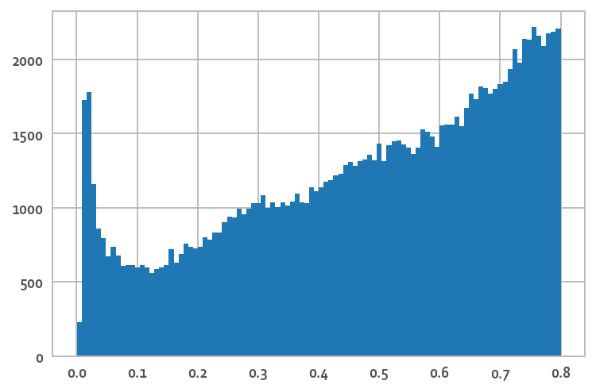
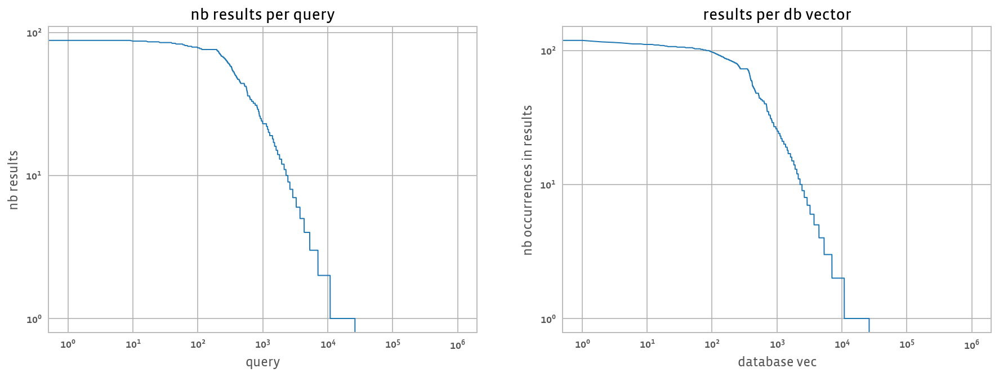
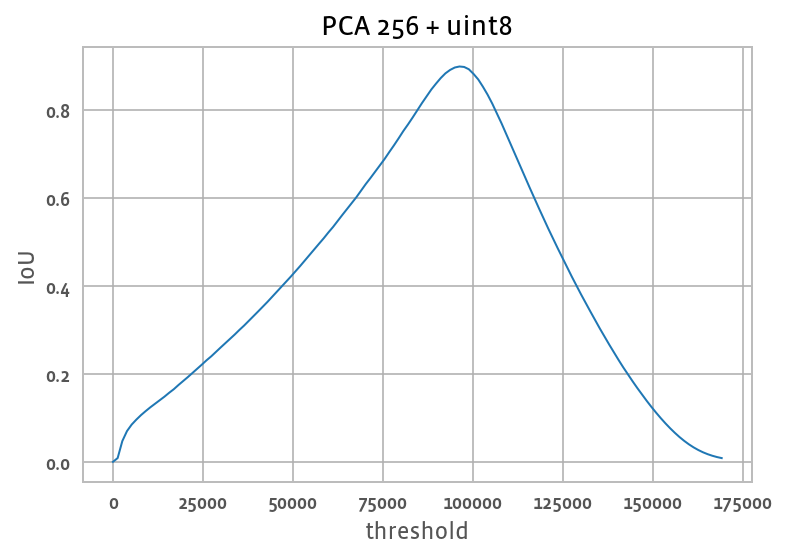

# The Facebook SimSearchNet++ dataset

SimSearchNet++ features are extracted from the images.  
In production, the features are used for image copy detection for integrity purposes. 
There is some detail in [this blog post](https://ai.facebook.com/blog/using-ai-to-detect-covid-19-misinformation-and-exploitative-content)

The SSN++ features are intially in 512 dimensions, L2-normalized and in floating-point. 
They are compared with a given threshold (squared L2 < 0.8) and images are deemed to match and input to further processing if the distance between images are below that threshold. 

## Data preparation

This dataset is built form public Instagram images from a variety of countries.
The SSN++ features extracted from the images have been de-duplicated. After deduplication about 1.17B vectors remain.

99% of the dataset is used for the database vectors. 

1% of the dataset is set apart for queries, experiments and PCA training.

### Selecting queries 

We randomly sample 3 sets of 1M vectors each from the 1%: A, B and C. 

A are the candidate query vectors. 
We compute the exact range search matches of A into database B with threshold 0.8. 
This yields 124210 results, with a distance histogram that looks like: 

The leftmost peak corresponds to very near image copies. 
When the threshold is relaxed, more images get matches, and the 0.8 threshold is quite arbitrary. 
With a 1B dataset the number of matches is expected to increase to 124k * 1000 = 124M matches. 

It is useful to look at the number of results per query vector and the number of database vectors that appear to be matching with a query vector: 

Both plots are in log-log scale and sorted by decreasing frequencies. 
This way of visualizing is useful because the data distribution is very bursty: 
for example, 10 query vectors get almost 100 results and fewer than 20k vectors of the 1M queries have a result at all.

This happens often on range search with real data because (1) most images are unique (no match) and (2) there are "meme" images that are posted many times with small variations, which creates clusters of images with many matches. 

From a benchmarking point of view, memes are not interesting because they rarely appear in search results. On the other hand, vectors with no matches are relevant for applications: the ANN algorihtm should indeed be able to not retrieve anything for them.
Therefore, we do a pass to remove the candidate queries with most matches. 
We arbitrarily chose a threshold of 30 matches, which reduces the number of candidate queries to 999086 and the total number of matches to 71357. 

We keep the first and second 100k of the resulting query candidates as public query set and held-out query set.

### Compressing the dataset 

To make the dataset less bulky, the features have been reduced to 256 dimensions by PCA (trained on subset C) and encoded in uint8. 
The effect of this compression is a loss of precision w.r.t. the ground-truth matches. 
This means that the comparison threshold is also adjusted to a squared L2 distance. 
We select the "compressed" L2 threshold as the one that maximizes the IoU of the results wrt. the float32 results. 
This happens for a squared L2 threshold of **96237**. 

The challenge ground truth is recomputed *after* compression with this threshold. 

## Data files

Database:

https://dl.fbaipublicfiles.com/billion-scale-ann-benchmarks/FB_ssnpp_database.u8bin

100k public queries:

https://dl.fbaipublicfiles.com/billion-scale-ann-benchmarks/FB_ssnpp_public_queries.u8bin

Ground truth: 

https://dl.fbaipublicfiles.com/billion-scale-ann-benchmarks/FB_ssnpp_public_queries_GT.rangeres

100k held-out queries (the XXXX is known only to the organizers):

https://dl.fbaipublicfiles.com/billion-scale-ann-benchmarks/FB_ssnpp_heldout_queries_XXXX.u8bin

Ground truth: TODO 

## License

The FB SSN++ dataset is licensed under the [CC-by-NC](https://creativecommons.org/licenses/by-nc/2.0/) license.
