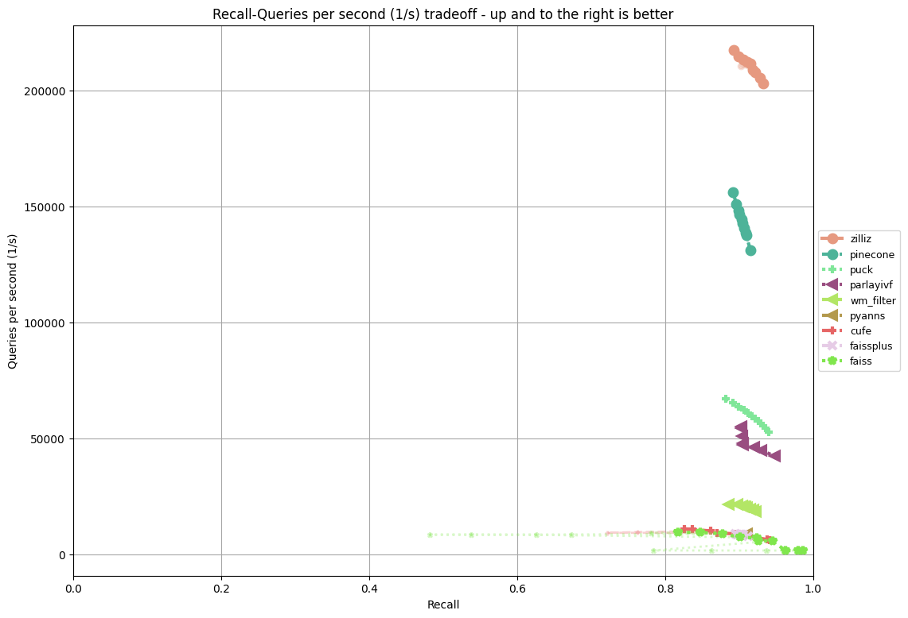
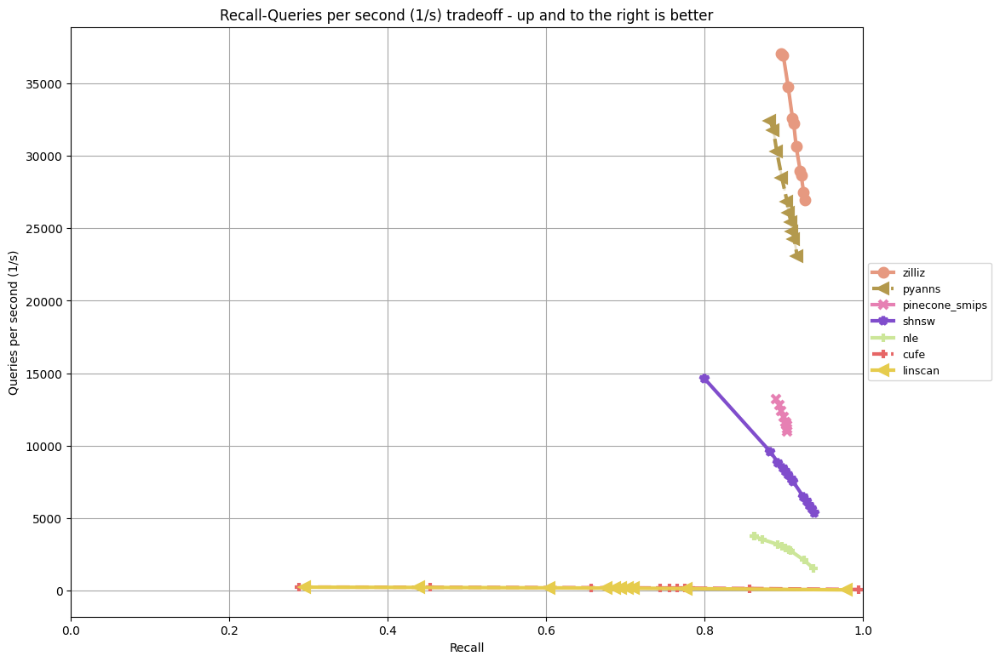
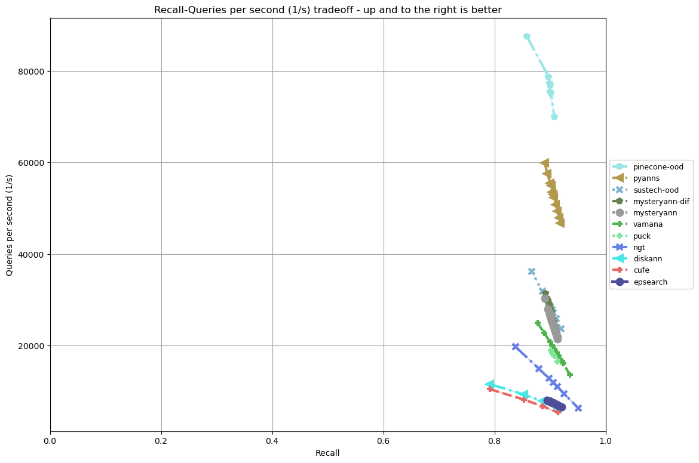

# Eval On AMD 3GHz/16-Core CPU + 125GB RAM + NVMe SSD (Bare Metal)

## Table Of Contents

- [Introduction](#introduction)  
- [Results](#results) 
- [Hardware Inventory](#hardware_inventory)
- [How To Reproduce](#how_to_reproduce)
- [TODO](#todo)  
- [Disclaimers And Credits](#disclaimers_and_credits)  

## Introduction

The NeurIPS2023 Practical Vector Search Challenge evaluated participating algorithms on Azure and EC2 CPU-based hardware instances.

In pursuit of expanding the evaluation criteria, we are evaluating on other generally available hardware configurations.

Shown here are results run on the following hardware:
* AMD EPYC 9124 16-Core 3GHz processor
* 125GB RAM 
* 440GB NVMe SSD
* Bare-metal "m2-medium" instance provided by [Latitude](https://www.latitude.sh/) 

We include a [detailed hardware inventory.](#hardware_inventory)

## Results

### Track: Filter



### Track: Sparse



### Track: OOD



### Track: Streaming


### Data Export

The full data export CSV file can be found [here.](latitude/data_export.csv)

## Hardware_Inventory

The use the following Linux commands to capture the detailed hardware inventory:
* *lshw*
* *hwinfo*
* *procinfo*

### Via *lshw*

The following is a summary hardware inventory using the *lshw* Linux command:
```
$ sudo lshw -short
H/W path              Device          Class          Description
================================================================
                                      system         AS -2115GT-HNTR (To be filled by O.E.M.)
/0                                    bus            H13SST-G
/0/0                                  memory         64KiB BIOS
/0/20                                 memory         1MiB L1 cache
/0/21                                 memory         16MiB L2 cache
/0/22                                 memory         64MiB L3 cache
/0/23                                 processor      AMD EPYC 9124 16-Core Processor
/0/26                                 memory         128GiB System Memory
/0/26/0                               memory         64GiB DIMM Synchronous Registered (Buffered) 4800 MHz (0.2 ns)
/0/26/1                               memory         [empty]
/0/26/2                               memory         [empty]
/0/26/3                               memory         [empty]
/0/26/4                               memory         [empty]
/0/26/5                               memory         [empty]
/0/26/6                               memory         64GiB DIMM Synchronous Registered (Buffered) 4800 MHz (0.2 ns)
/0/26/7                               memory         [empty]
/0/26/8                               memory         [empty]
/0/26/9                               memory         [empty]
/0/26/a                               memory         [empty]
/0/26/b                               memory         [empty]
/0/100                                bridge         Advanced Micro Devices, Inc. [AMD]
/0/100/0.2                            generic        Advanced Micro Devices, Inc. [AMD]
/0/100/0.3                            generic        Advanced Micro Devices, Inc. [AMD]
/0/100/1.1                            bridge         Advanced Micro Devices, Inc. [AMD]
/0/100/1.1/0                          storage        Samsung Electronics Co Ltd
/0/100/1.1/0/0        /dev/nvme2      storage        SAMSUNG MZQL21T9HCJR-00A07
/0/100/1.1/0/0/1      /dev/nvme2n1    disk           1920GB NVMe namespace
/0/100/1.2                            bridge         Advanced Micro Devices, Inc. [AMD]
/0/100/1.2/0                          storage        Samsung Electronics Co Ltd
/0/100/1.2/0/0        /dev/nvme3      storage        SAMSUNG MZQL21T9HCJR-00A07
/0/100/1.2/0/0/1      /dev/nvme3n1    disk           1920GB NVMe namespace
/0/100/1.3                            bridge         Advanced Micro Devices, Inc. [AMD]
/0/100/1.4                            bridge         Advanced Micro Devices, Inc. [AMD]
/0/100/3.1                            bridge         Advanced Micro Devices, Inc. [AMD]
/0/100/3.1/0          eno1            network        Ethernet Controller X710 for 10GBASE-T
/0/100/3.1/0.1        eno2            network        Ethernet Controller X710 for 10GBASE-T
/0/100/7.1                            bridge         Advanced Micro Devices, Inc. [AMD]
/0/100/7.1/0                          generic        Advanced Micro Devices, Inc. [AMD]
/0/100/7.1/0.1                        generic        Advanced Micro Devices, Inc. [AMD]
/0/100/7.1/0.4                        bus            Advanced Micro Devices, Inc. [AMD]
/0/100/7.1/0.4/0      usb3            bus            xHCI Host Controller
/0/100/7.1/0.4/0/1                    bus            USB2.0 Hub
/0/100/7.1/0.4/0/2                    bus            USB2.0 Hub
/0/100/7.1/0.4/1      usb4            bus            xHCI Host Controller
/0/100/7.1/0.5                        generic        Advanced Micro Devices, Inc. [AMD]
/0/100/7.2                            bridge         Advanced Micro Devices, Inc. [AMD]
/0/100/7.2/0                          storage        FCH SATA Controller [AHCI mode]
/0/100/14                             bus            FCH SMBus Controller
/0/100/14.3                           bridge         FCH LPC Bridge
/0/101                                bridge         Advanced Micro Devices, Inc. [AMD]
/0/102                                bridge         Advanced Micro Devices, Inc. [AMD]
/0/103                                bridge         Advanced Micro Devices, Inc. [AMD]
/0/104                                bridge         Advanced Micro Devices, Inc. [AMD]
/0/105                                bridge         Advanced Micro Devices, Inc. [AMD]
/0/106                                bridge         Advanced Micro Devices, Inc. [AMD]
/0/107                                bridge         Advanced Micro Devices, Inc. [AMD]
/0/108                                bridge         Advanced Micro Devices, Inc. [AMD]
/0/109                                bridge         Advanced Micro Devices, Inc. [AMD]
/0/10a                                bridge         Advanced Micro Devices, Inc. [AMD]
/0/10b                                bridge         Advanced Micro Devices, Inc. [AMD]
/0/10c                                bridge         Advanced Micro Devices, Inc. [AMD]
/0/10d                                bridge         Advanced Micro Devices, Inc. [AMD]
/0/10e                                bridge         Advanced Micro Devices, Inc. [AMD]
/0/10f                                bridge         Advanced Micro Devices, Inc. [AMD]
/0/10f/0.2                            generic        Advanced Micro Devices, Inc. [AMD]
/0/10f/0.3                            generic        Advanced Micro Devices, Inc. [AMD]
/0/10f/1.1                            bridge         Advanced Micro Devices, Inc. [AMD]
/0/10f/1.2                            bridge         Advanced Micro Devices, Inc. [AMD]
/0/10f/1.3                            bridge         Advanced Micro Devices, Inc. [AMD]
/0/10f/1.4                            bridge         Advanced Micro Devices, Inc. [AMD]
/0/10f/7.1                            bridge         Advanced Micro Devices, Inc. [AMD]
/0/10f/7.1/0                          generic        Advanced Micro Devices, Inc. [AMD]
/0/10f/7.1/0.1                        generic        Advanced Micro Devices, Inc. [AMD]
/0/110                                bridge         Advanced Micro Devices, Inc. [AMD]
/0/111                                bridge         Advanced Micro Devices, Inc. [AMD]
/0/112                                bridge         Advanced Micro Devices, Inc. [AMD]
/0/113                                bridge         Advanced Micro Devices, Inc. [AMD]
/0/114                                bridge         Advanced Micro Devices, Inc. [AMD]
/0/115                                bridge         Advanced Micro Devices, Inc. [AMD]
/0/116                                bridge         Advanced Micro Devices, Inc. [AMD]
/0/116/0.2                            generic        Advanced Micro Devices, Inc. [AMD]
/0/116/0.3                            generic        Advanced Micro Devices, Inc. [AMD]
/0/116/7.1                            bridge         Advanced Micro Devices, Inc. [AMD]
/0/116/7.1/0                          generic        Advanced Micro Devices, Inc. [AMD]
/0/116/7.1/0.1                        generic        Advanced Micro Devices, Inc. [AMD]
/0/117                                bridge         Advanced Micro Devices, Inc. [AMD]
/0/118                                bridge         Advanced Micro Devices, Inc. [AMD]
/0/119                                bridge         Advanced Micro Devices, Inc. [AMD]
/0/11a                                bridge         Advanced Micro Devices, Inc. [AMD]
/0/11b                                bridge         Advanced Micro Devices, Inc. [AMD]
/0/11c                                bridge         Advanced Micro Devices, Inc. [AMD]
/0/11d                                bridge         Advanced Micro Devices, Inc. [AMD]
/0/11d/0.2                            generic        Advanced Micro Devices, Inc. [AMD]
/0/11d/0.3                            generic        Advanced Micro Devices, Inc. [AMD]
/0/11d/1.1                            bridge         Advanced Micro Devices, Inc. [AMD]
/0/11d/1.1/0                          storage        Micron Technology Inc
/0/11d/1.1/0/0        /dev/nvme0      storage        Micron_7450_MTFDKBA480TFR
/0/11d/1.1/0/0/1      /dev/nvme0n1    disk           480GB NVMe namespace
/0/11d/1.1/0/0/1/1    /dev/nvme0n1p1  volume         1023KiB BIOS Boot partition
/0/11d/1.1/0/0/1/2    /dev/nvme0n1p2  volume         447GiB EXT4 volume
/0/11d/1.2                            bridge         Advanced Micro Devices, Inc. [AMD]
/0/11d/1.2/0                          storage        Micron Technology Inc
/0/11d/1.2/0/0        /dev/nvme1      storage        Micron_7450_MTFDKBA480TFR
/0/11d/1.2/0/0/1      /dev/nvme1n1    disk           480GB NVMe namespace
/0/11d/5.2                            bridge         Advanced Micro Devices, Inc. [AMD]
/0/11d/5.2/0                          bridge         AST1150 PCI-to-PCI Bridge
/0/11d/5.2/0/0                        display        ASPEED Graphics Family
/0/11d/7.1                            bridge         Advanced Micro Devices, Inc. [AMD]
/0/11d/7.1/0                          generic        Advanced Micro Devices, Inc. [AMD]
/0/11d/7.1/0.1                        generic        Advanced Micro Devices, Inc. [AMD]
/0/11d/7.1/0.4                        bus            Advanced Micro Devices, Inc. [AMD]
/0/11d/7.1/0.4/0      usb1            bus            xHCI Host Controller
/0/11d/7.1/0.4/0/1                    bus            USB Virtual Hub
/0/11d/7.1/0.4/0/1/1                  input          SMCI HID KM
/0/11d/7.1/0.4/0/1/2  usb0            communication  RNDIS/Ethernet Gadget
/0/11d/7.1/0.4/1      usb2            bus            xHCI Host Controller
/0/11d/7.2                            bridge         Advanced Micro Devices, Inc. [AMD]
/0/11d/7.2/0                          storage        FCH SATA Controller [AHCI mode]
/0/11d/7.2/0.1                        storage        FCH SATA Controller [AHCI mode]
/0/11e                                bridge         Advanced Micro Devices, Inc. [AMD]
/0/11f                                bridge         Advanced Micro Devices, Inc. [AMD]
/0/120                                bridge         Advanced Micro Devices, Inc. [AMD]
/0/121                                bridge         Advanced Micro Devices, Inc. [AMD]
/0/122                                bridge         Advanced Micro Devices, Inc. [AMD]
/0/123                                bridge         Advanced Micro Devices, Inc. [AMD]
/0/1                                  system         PnP device PNP0c01
/0/2                                  system         PnP device PNP0b00
/0/3                                  system         PnP device PNP0c02
/0/4                                  communication  PnP device PNP0501
/0/5                                  communication  PnP device PNP0501
/0/6                                  system         PnP device PNP0c02
/1                                    power          PWS-2K21A-BR
/2                                    power          PWS-2K21A-BR

```

The full detailed inventory can be found [here.](latitude/lshw.txt)

### Via *hwinfo*

The following is a summary hardware invontory using the *hwinfo* Linux command:
```
$ sudo hwinfo --short
cpu:                                                            
                       AMD EPYC 9124 16-Core Processor, 1496 MHz
                       AMD EPYC 9124 16-Core Processor, 1495 MHz
                       AMD EPYC 9124 16-Core Processor, 1497 MHz
                       AMD EPYC 9124 16-Core Processor, 1497 MHz
                       AMD EPYC 9124 16-Core Processor, 1494 MHz
                       AMD EPYC 9124 16-Core Processor, 1497 MHz
                       AMD EPYC 9124 16-Core Processor, 1500 MHz
                       AMD EPYC 9124 16-Core Processor, 1497 MHz
                       AMD EPYC 9124 16-Core Processor, 1496 MHz
                       AMD EPYC 9124 16-Core Processor, 1495 MHz
                       AMD EPYC 9124 16-Core Processor, 1500 MHz
                       AMD EPYC 9124 16-Core Processor, 1494 MHz
                       AMD EPYC 9124 16-Core Processor, 1496 MHz
                       AMD EPYC 9124 16-Core Processor, 1497 MHz
                       AMD EPYC 9124 16-Core Processor, 1496 MHz
                       AMD EPYC 9124 16-Core Processor, 1497 MHz
                       AMD EPYC 9124 16-Core Processor, 1500 MHz
                       AMD EPYC 9124 16-Core Processor, 1500 MHz
                       AMD EPYC 9124 16-Core Processor, 1500 MHz
                       AMD EPYC 9124 16-Core Processor, 1497 MHz
                       AMD EPYC 9124 16-Core Processor, 1500 MHz
                       AMD EPYC 9124 16-Core Processor, 1496 MHz
                       AMD EPYC 9124 16-Core Processor, 1496 MHz
                       AMD EPYC 9124 16-Core Processor, 1496 MHz
                       AMD EPYC 9124 16-Core Processor, 1500 MHz
                       AMD EPYC 9124 16-Core Processor, 1493 MHz
                       AMD EPYC 9124 16-Core Processor, 1500 MHz
                       AMD EPYC 9124 16-Core Processor, 1495 MHz
                       AMD EPYC 9124 16-Core Processor, 1493 MHz
                       AMD EPYC 9124 16-Core Processor, 1496 MHz
                       AMD EPYC 9124 16-Core Processor, 1496 MHz
                       AMD EPYC 9124 16-Core Processor, 1500 MHz
keyboard:
  /dev/ttyS1           serial console
mouse:
  /dev/input/mice      ATEN International SMCI HID KM
graphics card:
                       ASPEED AST1000/2000
storage:
                       AMD FCH SATA Controller [AHCI mode]
                       Samsung Electronics Non-Volatile memory controller
                       Micron Non-Volatile memory controller
                       Samsung Electronics Non-Volatile memory controller
                       Micron Non-Volatile memory controller
                       AMD FCH SATA Controller [AHCI mode]
                       AMD FCH SATA Controller [AHCI mode]
network:
  eno2                 Intel Ethernet Controller X710 for 10GBASE-T
  eno1                 Intel Ethernet Controller X710 for 10GBASE-T
  usb0                 Insyde Software RNDIS/Ethernet Gadget
network interface:
  docker0              Ethernet network interface
  eno2                 Ethernet network interface
  usb0                 USB-Link network interface
  lo                   Loopback network interface
  eno1                 Ethernet network interface
disk:
  /dev/nvme0n1         Micron Disk
  /dev/nvme3n1         Samsung Electronics Disk
  /dev/nvme2n1         Samsung Electronics Disk
  /dev/nvme1n1         Micron Disk
partition:
  /dev/nvme0n1p1       Partition
  /dev/nvme0n1p2       Partition
usb controller:
                       AMD USB Controller
                       AMD USB Controller
bios:
                       BIOS
bridge:
                       AMD PCI bridge
                       ASPEED AST1150 PCI-to-PCI Bridge
                       AMD PCI bridge
                       AMD Host bridge
                       AMD Host bridge
                       AMD PCI bridge
                       AMD Host bridge
                       AMD PCI bridge
                       AMD PCI bridge
                       AMD Host bridge
                       AMD Host bridge
                       AMD Host bridge
                       AMD Host bridge
                       AMD PCI bridge
                       AMD PCI bridge
                       AMD Host bridge
                       AMD PCI bridge
                       AMD Host bridge
                       AMD FCH LPC Bridge
                       AMD Host bridge
                       AMD Host bridge
                       AMD Host bridge
                       AMD Host bridge
                       AMD Host bridge
                       AMD Host bridge
                       AMD Host bridge
                       AMD Host bridge
                       AMD Host bridge
                       AMD Host bridge
                       AMD Host bridge
                       AMD PCI bridge
                       AMD Host bridge
                       AMD Host bridge
                       AMD Host bridge
                       AMD Host bridge
                       AMD Host bridge
                       AMD PCI bridge
                       AMD PCI bridge
                       AMD PCI bridge
                       AMD Host bridge
                       AMD Host bridge
                       AMD Host bridge
                       AMD PCI bridge
                       AMD Host bridge
                       AMD PCI bridge
                       AMD PCI bridge
                       AMD Host bridge
                       AMD Host bridge
                       AMD PCI bridge
                       AMD Host bridge
                       AMD PCI bridge
                       AMD Host bridge
                       AMD Host bridge
                       AMD Host bridge
                       AMD Host bridge
                       AMD PCI bridge
hub:
                       Linux Foundation 2.0 root hub
                       Genesys Logic 4-port hub
                       Linux Foundation 3.0 root hub
                       Linux Foundation 2.0 root hub
                       Genesys Logic 4-port hub
                       Linux Foundation USB Virtual Hub
                       Linux Foundation 3.0 root hub
memory:
                       Main Memory
unknown:
                       FPU
                       DMA controller
                       PIC
                       Keyboard controller
                       PS/2 Controller
                       AMD Generic system peripheral
                       AMD System peripheral
                       AMD System peripheral
                       AMD IOMMU
                       AMD IOMMU
                       AMD IOMMU
                       AMD Non-Essential Instrumentation
                       AMD Non-Essential Instrumentation
                       AMD IOMMU
                       AMD Non-Essential Instrumentation
                       AMD Encryption controller
                       AMD Non-Essential Instrumentation
                       AMD Generic system peripheral
                       AMD Generic system peripheral
                       AMD FCH SMBus Controller
                       AMD Generic system peripheral
                       AMD System peripheral
                       AMD System peripheral
  /dev/ttyS0           16550A
  /dev/ttyS1           16550A
  /dev/input/event1    ATEN International SMCI HID KM

```

The full detailed output can be found [here.](latitude/hwinfo.txt)

### Via *procinfo*

```
$ sudo procinfo -H
Memory:        Total        Used        Free     Buffers                       
RAM:       125.59GiB    72.94GiB    52.65GiB   555.18MiB                       
Swap:        8.00GiB    10.75MiB     7.99GiB                                   

Bootup: Sun May 12 23:22:02 2024   Load average: 0.02 0.01 0.01 1/540 66788    

user  :      7w 4d 17:44:17.62   1.6%  page in :         85965401              
nice  :            00:12:46.10   0.0%  page out:       1536712764              
system:         3d 11:47:59.71   0.1%  page act:        121399932              
IOwait:            00:21:10.95   0.0%  page dea:         17233633              
hw irq:            00:00:00.00   0.0%  page flt:      20383773616              
sw irq:            14:35:17.36   0.0%  swap in :             1576              
idle  :    481w 3d 13:37:25.47  98.3%  swap out:             3406              
uptime:   3m 2w 1d 04:05:07.56         context :      49396401992              

irq   0:         73  2-edge timer        irq 168:    1129068  2621451-edge i40e
irq   3:       2734  3-edge ttyS1        irq 169:    3380392  2621452-edge i40e
irq   4:         32  4-edge              irq 170:    1276901  2621453-edge i40e
irq   6:          0  6-edge AMDI0010:0   irq 171:    1417138  2621454-edge i40e
irq   7:          0  7-fasteoi pinctrl   irq 172:     422311  2621455-edge i40e
irq   8:          1  8-edge rtc0         irq 173:    1513854  2621456-edge i40e
irq   9:          0  9-fasteoi acpi      irq 174:     748023  2621457-edge i40e
irq  10:          0  10-edge AMDI0010:   irq 175:    1225714  2621458-edge i40e
irq  11:          0  11-edge AMDI0010:   irq 176:    1344403  2621459-edge i40e
irq  12:          0  12-edge AMDI0010:   irq 177:    2038285  2621460-edge i40e
irq  14:          0  14-edge AMDI0010:   irq 178:    1788856  2621461-edge i40e
irq  15:          0  15-edge AMDI0010:   irq 179:    3341840  2621462-edge i40e
irq  27:          0  100667392-edge AM   irq 180:    1047305  2621463-edge i40e
irq  28:          0  67112960-edge AMD   irq 181:    1566477  2621464-edge i40e
irq  29:          0  4096-edge AMD-Vi    irq 182:    1478963  2621465-edge i40e
irq  30:          0  33558528-edge AMD   irq 183:    2141053  2621466-edge i40e
irq  31:          0  100681728-edge PC   irq 184:    1445826  2621467-edge i40e
irq  32:          0  100683776-edge PC   irq 185:    3063504  2621468-edge i40e
irq  33:          0  100749312-edge PC   irq 186:    1966570  2621469-edge i40e
irq  34:          0  100780032-edge PC   irq 187:     679834  2621470-edge i40e
irq  35:          0  100782080-edge PC   irq 188:    1343521  2621471-edge i40e
irq  37:          0  67225600-edge PCI   irq 189:     374837  2621472-edge i40e
irq  38:          1  18432-edge PCIe P   irq 190:          0  2621473-edge i40e
irq  39:          1  20480-edge PCIe P   irq 200:          0  103811072-edge ah
irq  40:          1  22528-edge PCIe P   irq 201:          0  103811073-edge ah
irq  41:          1  24576-edge PCIe P   irq 202:          0  103811074-edge ah
irq  42:          0  51200-edge PCIe P   irq 203:          0  103811075-edge ah
irq  43:          0  116736-edge PCIe    irq 204:          0  103811076-edge ah
irq  44:          0  118784-edge PCIe    irq 205:          0  103811077-edge ah
irq  45:          1  33572864-edge PCI   irq 206:          0  103811078-edge ah
irq  46:          1  33574912-edge PCI   irq 207:          0  103811079-edge ah
irq  47:          1  33576960-edge PCI   irq 216:          0  524289-edge nvme2
irq  48:          1  33579008-edge PCI   irq 217:          8  524290-edge nvme2
irq  50:          0  33671168-edge PCI   irq 218:          0  524291-edge nvme2
irq  52:        131  103292928-edge xh   irq 219:          0  524292-edge nvme2
irq  53:          0  103292929-edge xh   irq 220:          9  524293-edge nvme2
irq  54:          0  103292930-edge xh   irq 221:          8  524294-edge nvme2
irq  55:          0  103292931-edge xh   irq 222:          8  524295-edge nvme2
irq  56:          0  103292932-edge xh   irq 223:          0  524296-edge nvme2
irq  57:          0  103292933-edge xh   irq 224:          0  524297-edge nvme2
irq  58:          0  103292934-edge xh   irq 225:         54  524298-edge nvme2
irq  59:          0  103292935-edge xh   irq 226:          0  524299-edge nvme2
irq  61:         89  3153920-edge xhci   irq 227:          3  524300-edge nvme2
irq  62:          0  3153921-edge xhci   irq 228:          2  524301-edge nvme2
irq  63:          0  3153922-edge xhci   irq 229:         12  524302-edge nvme2
irq  64:          0  3153923-edge xhci   irq 230:         38  524303-edge nvme2
irq  65:          0  3153924-edge xhci   irq 231:          1  524304-edge nvme2
irq  66:          0  3153925-edge xhci   irq 232:          0  524305-edge nvme2
irq  67:          0  3153926-edge xhci   irq 233:         46  524306-edge nvme2
irq  68:          0  3153927-edge xhci   irq 234:          0  524307-edge nvme2
irq  70:        282  101187584-edge nv   irq 235:          0  524308-edge nvme2
irq  71:        282  101711872-edge nv   irq 236:         54  524309-edge nvme2
irq  76:          0  103809027-edge ah   irq 237:          8  524310-edge nvme2
irq  78:          0  103809029-edge ah   irq 238:          0  524311-edge nvme2
irq  91:        282  524288-edge nvme2   irq 239:          8  524312-edge nvme2
irq  92:        282  1048576-edge nvme   irq 240:          0  524313-edge nvme2
irq  93:    1069190  101187585-edge nv   irq 241:          0  524314-edge nvme2
irq  94:    1688792  101187586-edge nv   irq 242:         10  524315-edge nvme2
irq  95:    1345530  101187587-edge nv   irq 243:          0  524316-edge nvme2
irq  96:    1226962  101187588-edge nv   irq 244:          1  524317-edge nvme2
irq  97:     368560  101187589-edge nv   irq 245:          0  524318-edge nvme2
irq  98:     292364  101187590-edge nv   irq 246:          8  524319-edge nvme2
irq  99:     285019  101187591-edge nv   irq 247:         17  524320-edge nvme2
irq 100:     260102  101187592-edge nv   irq 248:          0  1048577-edge nvme
irq 101:     261305  101187593-edge nv   irq 249:          8  1048578-edge nvme
irq 102:     298074  101187594-edge nv   irq 250:          0  1048579-edge nvme
irq 103:     261220  101187595-edge nv   irq 251:          0  1048580-edge nvme
irq 104:     306060  101187596-edge nv   irq 252:          9  1048581-edge nvme
irq 105:     262949  101187597-edge nv   irq 253:          8  1048582-edge nvme
irq 106:     246713  101187598-edge nv   irq 254:          8  1048583-edge nvme
irq 107:     247832  101187599-edge nv   irq 255:          2  1048584-edge nvme
irq 108:     219355  101187600-edge nv   irq 256:          0  1048585-edge nvme
irq 109:     951253  101187601-edge nv   irq 257:         54  1048586-edge nvme
irq 110:     854065  101187602-edge nv   irq 258:          0  1048587-edge nvme
irq 111:     791847  101187603-edge nv   irq 259:          0  1048588-edge nvme
irq 112:     750889  101187604-edge nv   irq 260:          2  1048589-edge nvme
irq 113:     282475  101187605-edge nv   irq 261:          3  1048590-edge nvme
irq 114:     243713  101187606-edge nv   irq 262:          2  1048591-edge nvme
irq 115:     236272  101187607-edge nv   irq 263:          2  1048592-edge nvme
irq 116:     240761  101187608-edge nv   irq 264:          0  1048593-edge nvme
irq 117:     229187  101187609-edge nv   irq 265:          0  1048594-edge nvme
irq 118:     236650  101187610-edge nv   irq 266:          0  1048595-edge nvme
irq 119:     208384  101187611-edge nv   irq 267:          0  1048596-edge nvme
irq 120:     243660  101187612-edge nv   irq 268:         54  1048597-edge nvme
irq 121:     268895  101187613-edge nv   irq 269:         10  1048598-edge nvme
irq 122:     234036  101187614-edge nv   irq 270:          0  1048599-edge nvme
irq 123:     234937  101187615-edge nv   irq 271:         50  1048600-edge nvme
irq 124:     225049  101187616-edge nv   irq 272:          0  1048601-edge nvme
irq 125:          0  101711873-edge nv   irq 273:          0  1048602-edge nvme
irq 126:          8  101711874-edge nv   irq 274:         10  1048603-edge nvme
irq 127:          0  101711875-edge nv   irq 275:         46  1048604-edge nvme
irq 128:         46  101711876-edge nv   irq 276:          2  1048605-edge nvme
irq 129:          9  101711877-edge nv   irq 277:          0  1048606-edge nvme
irq 130:          8  101711878-edge nv   irq 278:          8  1048607-edge nvme
irq 131:          8  101711879-edge nv   irq 279:         17  1048608-edge nvme
irq 132:          0  101711880-edge nv   irq 280:          0  2623488-edge i40e
irq 133:          0  101711881-edge nv   irq 281:        770  2623489-edge i40e
irq 134:         54  101711882-edge nv   irq 282:        936  2623490-edge i40e
irq 135:          0  101711883-edge nv   irq 283:       1429  2623491-edge i40e
irq 136:          0  101711884-edge nv   irq 284:       5712  2623492-edge i40e
irq 137:          2  101711885-edge nv   irq 285:       1848  2623493-edge i40e
irq 138:          0  101711886-edge nv   irq 286:       3798  2623494-edge i40e
irq 139:          5  101711887-edge nv   irq 287:       2030  2623495-edge i40e
irq 140:          0  101711888-edge nv   irq 288:       2845  2623496-edge i40e
irq 141:          0  101711889-edge nv   irq 289:       5654  2623497-edge i40e
irq 142:          0  101711890-edge nv   irq 290:       3494  2623498-edge i40e
irq 143:          0  101711891-edge nv   irq 291:       2204  2623499-edge i40e
irq 144:          0  101711892-edge nv   irq 292:       3188  2623500-edge i40e
irq 145:         54  101711893-edge nv   irq 293:       4059  2623501-edge i40e
irq 146:          8  101711894-edge nv   irq 294:       6611  2623502-edge i40e
irq 147:          0  101711895-edge nv   irq 295:       6053  2623503-edge i40e
irq 148:          8  101711896-edge nv   irq 296:       4016  2623504-edge i40e
irq 149:         46  101711897-edge nv   irq 297:       1026  2623505-edge i40e
irq 150:          3  101711898-edge nv   irq 298:       4317  2623506-edge i40e
irq 151:         10  101711899-edge nv   irq 299:       2266  2623507-edge i40e
irq 152:          0  101711900-edge nv   irq 300:       1339  2623508-edge i40e
irq 153:          0  101711901-edge nv   irq 301:       2439  2623509-edge i40e
irq 154:          1  101711902-edge nv   irq 302:       7090  2623510-edge i40e
irq 155:          8  101711903-edge nv   irq 303:    4390081  2623511-edge i40e
irq 156:         17  101711904-edge nv   irq 304:       5749  2623512-edge i40e
irq 157:          0  2621440-edge i40e   irq 305:       2450  2623513-edge i40e
irq 158:    2256731  2621441-edge i40e   irq 306:       2673  2623514-edge i40e
irq 159:     466380  2621442-edge i40e   irq 307:       2954  2623515-edge i40e
irq 160:     932556  2621443-edge i40e   irq 308:      17669  2623516-edge i40e
irq 161:     928238  2621444-edge i40e   irq 309:       2967  2623517-edge i40e
irq 162:     984544  2621445-edge i40e   irq 310:       4970  2623518-edge i40e
irq 163:    3104630  2621446-edge i40e   irq 311:       3486  2623519-edge i40e
irq 164:    1737316  2621447-edge i40e   irq 312:      18167  2623520-edge i40e
irq 165:    1855901  2621448-edge i40e   irq 313:          0  2623521-edge i40e
irq 166:    1362336  2621449-edge i40e   irq 323:          0  3670016-edge ahci
irq 167:    2969421  2621450-edge i40e                                         


docker0     TX 60.03GiB      RX 179.63MiB     lo          TX 952.62KiB     RX 952.62KiB    
eno1        TX 12.20GiB      RX 149.29GiB     usb0        TX 0.00B         RX 0.00B        
eno2        TX 7.01MiB       RX 448.80MiB                                  
```

## How_To_Reproduce 

The following steps will allow you to reproduce the results shown above.

### Preparation

* Signup for/sign into your Latitude account 
* Provision an "m2-medium" instance with at least 100GB NVMe SSD with Linux 20.04.06 LTS
* ssh remotely into the instance
* update Linux via command ```sudo apt-get update```
* install Anaconda for Linux
* run the following commands:
```
git clone git@github.com:harsha-simhadri/big-ann-benchmarks.git
cd big-ann-benchmarks
conda create -n bigann-latitude-m2-medium python=3.10
conda activate bigann-latitude-m2-medium
python -m pip install -r requirements_py3.10.txt 
```

### Sparse Track

Prepare the track dataset by running the following command in the top-level directory of the repository:
```
python create_dataset.py --dataset sparse-full
```
#### Sparse Algorithm: cufe

```
python install.py --neurips23track sparse --algorithm cufe
python -m pip install requests==2.31.0 # urllib3.exceptions.URLSchemeUnknown: Not supported URL scheme http+docker
```

#### Sparse Algorithm: linscan

```
python install.py --neurips23track sparse --algorithm linscan
python run.py --dataset sparse-full --algorithm linscan --neurips23track sparse
``` 

#### Sparse Algorithm: nle

```
python install.py --neurips23track sparse --algorithm nle
python run.py --dataset sparse-full --algorithm nle --neurips23track sparse
```

#### Sparse Algorithm: pyanns

```
python install.py --neurips23track sparse --algorithm pyanns
python run.py --dataset sparse-full --algorithm pyanns --neurips23track sparse
```

#### Sparse Algorithm: shnsw

```
python install.py --neurips23track sparse --algorithm shnsw
python run.py --dataset sparse-full --algorithm shnsw --neurips23track sparse
```

#### Sparse Algorithm: spmat

```
python install.py --neurips23track sparse --algorithm spmat
python run.py --dataset sparse-full --algorithm spmat --neurips23track sparse # ERROR: sparse-full is not in spmat/config.yaml
```

#### Sparse Algorithm: sustech-whu

```
python install.py --neurips23track sparse --algorithm sustech-whu 
# ERROR: git could not clone 'https://github.com/lizzy-0323/SUSTech-WHU-Sparse.git'
```

### Sparse Algorithm: pinecone_smips

```
python install.py --neurips23track sparse --algorithm pinecone_smips
python run.py --dataset sparse-full --algorithm pinecone_smips  --neurips23track sparse
```

### Filter Track

Prepare the track dataset by running the following command in the top-level directory of the repository:
```
python create_dataset.py --dataset yfcc-10M
```

#### Filter Algorithm: cufe

```
python install.py --neurips23track filter --algorithm cufe
python3 run.py --dataset yfcc-10M --algorithm cufe --neurips23track filter
```

#### Filter Algorithm: dhq

```
python install.py --neurips23track filter --algorithm dhq 
# ERROR: failed to solve: process "/bin/sh -c python3 -c 'import faiss; print(faiss.IDSelectorFilterWise); print(faiss.__version__)'" did not complete successfully: exit code: 1
```

#### Filter Algorithm: faiss

```
python install.py --neurips23track filter --algorithm faiss
python3 run.py --dataset yfcc-10M --algorithm faiss --neurips23track filter
```

#### Filter Algorithm: faissplus

```
python install.py --neurips23track filter --algorithm faissplus
python3 run.py --dataset yfcc-10M --algorithm faissplus --neurips23track filter
```

#### Filter Algorithm: fdufilterdiskann

```
python install.py --neurips23track filter --algorithm fdufilterdiskann
# ERROR: failed to solve: process "/bin/sh -c git clone --recursive --branch main https://github.com/PUITAR/FduFilterDiskANN.git" did not complete successfully: exit code: 128
```

#### Filter Algorithm: hwtl_sdu_anns_filter

```
python install.py --neurips23track filter --algorithm hwtl_sdu_anns_filter
# ERROR: failed to solve: process "/bin/sh -c python3 -c 'import faiss; print(faiss.IndexFlatL2); print(faiss.__version__)'" did not complete successfully: exit code: 1
```

#### Filter Algorithm: parlayivf

```
python install.py --neurips23track filter --algorithm parlayivf
python3 run.py --dataset yfcc-10M --algorithm parlayivf --neurips23track filter
```

#### Filter Algorithm: puck

```
python install.py --neurips23track filter --algorithm puck
python3 run.py --dataset yfcc-10M --algorithm puck --neurips23track filter
```

#### Filter Algorithm: pyanns

```
python install.py --neurips23track filter --algorithm pyanns
python3 run.py --dataset yfcc-10M --algorithm pyanns --neurips23track filter
```

#### Filter Algorithm: wm_filter

```
python install.py --neurips23track filter --algorithm wm_filter
python3 run.py --dataset yfcc-10M --algorithm wm_filter  --neurips23track filter
```

#### Filter Algorithm: pinecone

```
python install.py --neurips23track filter --algorithm pinecone
python run.py --neurips23track filter --algorithm pinecone --dataset yfcc-10M
```

### OOD Track

Prepare the track dataset by running the following command in the top-level directory of the repository:
```
python create_dataset.py --dataset text2image-10M 
```

#### OOD Algorithm: cufe

```
python install.py --neurips23track ood --algorithm cufe
python3 run.py --dataset text2image-10M --algorithm cufe --neurips23track ood
```

#### OOD Algorithm: diskann

```
python install.py --neurips23track ood --algorithm diskann
python3 run.py --dataset text2image-10M --algorithm diskann --neurips23track ood
```

#### OOD Algorithm: epsearch

```
python install.py --neurips23track ood --algorithm epsearch
python3 run.py --dataset text2image-10M --algorithm epsearch --neurips23track ood
```

#### OOD Algorithm: mysteryann

```
python install.py --neurips23track ood --algorithm mysteryann
python3 run.py --dataset text2image-10M --algorithm mysteryann --neurips23track ood
```

#### OOD Algorithm: mysteryann-dif

```
python install.py --neurips23track ood --algorithm mysteryann-dif
python3 run.py --dataset text2image-10M --algorithm mysteryann-dif --neurips23track ood
```

#### OOD Algorithm: ngt

```
python install.py --neurips23track ood --algorithm ngt
python3 run.py --dataset text2image-10M --algorithm ngt --neurips23track ood
```

#### OOD Algorithm: puck

```
python install.py --neurips23track ood --algorithm puck
python3 run.py --dataset text2image-10M --algorithm puck --neurips23track ood
```

#### OOD Algorithm: puck-fizz

```
python install.py --neurips23track ood --algorithm puck-fizz
ERROR: failed to solve: process "/bin/sh -c git clone -b ood-try https://github.com/baidu/puck.git" did not complete successfully: exit code: 128
```

#### OOD Algorithm: pyanns

```
python install.py --neurips23track ood --algorithm pyanns
python3 run.py --dataset text2image-10M --algorithm pyanns --neurips23track ood
```

#### OOD Algorithm: sustech-ood

```
python install.py --neurips23track ood --algorithm sustech-ood
python3 run.py --dataset text2image-10M --algorithm sustech-ood --neurips23track ood
```

#### OOD Algorithm: vamana

```
python install.py --neurips23track ood --algorithm vamana
python3 run.py --dataset text2image-10M --algorithm vamana --neurips23track ood
```

#### OOD Algorithm: pinecone-ood

```
python install.py --neurips23track ood --algorithm pinecone-ood
python run.py --neurips23track ood --algorithm pinecone-ood --dataset text2image-10M
```

### Streaming Track

Prepare the track dataset by running the following command in the top-level directory of the repository:
```
python create_dataset.py --dataset msturing-30M-clustered
python -m benchmark.streaming.download_gt --runbook_file neurips23/streaming/final_runbook.yaml  --dataset msturing-30M-clustered
```

#### Streaming Algorithm: cufe

```
python install.py --neurips23track streaming --algorithm cufe
python3 run.py --dataset msturing-30M-clustered --algorithm cufe --neurips23track streaming --runbook_path neurips23/streaming/final_runbook.yaml
```

#### Streaming Algorithm: diskann

```
python install.py --neurips23track streaming --algorithm diskann
python3 run.py --dataset msturing-30M-clustered --algorithm diskann --neurips23track streaming --runbook_path neurips23/streaming/final_runbook.yaml
```

#### Streaming Algorithm: hwtl_sdu_anns_stream

```
python install.py --neurips23track streaming --algorithm hwtl_sdu_anns_stream 
python3 run.py --dataset msturing-30M-clustered --algorithm hwtl_sdu_anns_stream  --neurips23track streaming --runbook_path neurips23/streaming/final_runbook.yaml
```

#### Streaming Algorithm: puck

```
python install.py --neurips23track streaming --algorithm puck
python3 run.py --dataset msturing-30M-clustered --algorithm puck  --neurips23track streaming --runbook_path neurips23/streaming/final_runbook.yaml
```

#### Streaming Algorithm: pyanns

```
python install.py --neurips23track streaming --algorithm pyanns
python3 run.py --dataset msturing-30M-clustered --algorithm pyanns --neurips23track streaming --runbook_path neurips23/streaming/final_runbook.yaml # error, see below
2024-08-27 19:54:57,239 - annb.cfb02d822e66 - ERROR - Container.wait for container cfb02d822e66 failed with exception
2024-08-27 19:54:57,239 - annb.cfb02d822e66 - ERROR - Invoked with ['--dataset', 'msturing-30M-clustered', '--algorithm', 'pyanns', '--module', 'neurips23.streaming.pyanns.pyanns', '--constructor', 'Pyanns', '
--runs', '5', '--count', '10', '--neurips23track', 'streaming', '--runbook_path', 'neurips23/streaming/final_runbook.yaml', '["euclidean", {"R": 32, "L": 100, "insert_threads": 8, "consolidate_threads": 8}]', 
'[{"Ls": 300, "T": 8}]', '[{"Ls": 400, "T": 8}]', '[{"Ls": 500, "T": 8}]', '[{"Ls": 600, "T": 8}]']
Traceback (most recent call last):
  File "/home/gwilliams/anaconda3/envs/bigann-latitude-m2-medium/lib/python3.10/site-packages/urllib3/response.py", line 748, in _error_catcher
    yield
  File "/home/gwilliams/anaconda3/envs/bigann-latitude-m2-medium/lib/python3.10/site-packages/urllib3/response.py", line 1206, in read_chunked
    self._update_chunk_length()
  File "/home/gwilliams/anaconda3/envs/bigann-latitude-m2-medium/lib/python3.10/site-packages/urllib3/response.py", line 1125, in _update_chunk_length
    line = self._fp.fp.readline()  # type: ignore[union-attr]
  File "/home/gwilliams/anaconda3/envs/bigann-latitude-m2-medium/lib/python3.10/socket.py", line 705, in readinto
    return self._sock.recv_into(b)
TimeoutError: timed out
```

#### Streaming Algorithm: scann

```
python install.py --neurips23track streaming --algorithm scann
python3 run.py --dataset msturing-30M-clustered --algorithm scann --neurips23track streaming --runbook_path neurips23/streaming/final_runbook.yaml 
```
#### Streaming Algorithm: pinecone

```
python install.py --neurips23track streaming --algorithm pinecone
python3 run.py --dataset msturing-30M-clustered --algorithm pinecone --neurips23track streaming --runbook_path neurips23/streaming/final_runbook.yaml # error, see below
2024-08-27 23:26:17,631 - annb.001a9034d319 - ERROR - Container.wait for container 001a9034d319 failed with exception
2024-08-27 23:26:17,631 - annb.001a9034d319 - ERROR - Invoked with ['--dataset', 'msturing-30M-clustered', '--algorithm', 'pinecone', '--module', 'neurips23.streaming.pinecone.pinecone', '
--constructor', 'pinecone', '--runs', '5', '--count', '10', '--neurips23track', 'streaming', '--runbook_path', 'neurips23/streaming/final_runbook.yaml', '["euclidean", {"R": 32, "L": 100, 
"insert_threads": 8, "consolidate_threads": 8}]', '[{"Ls": 300, "k_1": 30, "T": 8}]', '[{"Ls": 400, "k_1": 30, "T": 8}]', '[{"Ls": 500, "k_1": 30, "T": 8}]', '[{"Ls": 520, "k_1": 30, "T": 
8}]', '[{"Ls": 540, "k_1": 30, "T": 8}]', '[{"Ls": 560, "k_1": 30, "T": 8}]']
Traceback (most recent call last):
  File "/home/gwilliams/anaconda3/envs/bigann-latitude-m2-medium/lib/python3.10/site-packages/urllib3/response.py", line 748, in _error_catcher
    yield
  File "/home/gwilliams/anaconda3/envs/bigann-latitude-m2-medium/lib/python3.10/site-packages/urllib3/response.py", line 1206, in read_chunked
    self._update_chunk_length()
  File "/home/gwilliams/anaconda3/envs/bigann-latitude-m2-medium/lib/python3.10/site-packages/urllib3/response.py", line 1125, in _update_chunk_length
    line = self._fp.fp.readline()  # type: ignore[union-attr]
  File "/home/gwilliams/anaconda3/envs/bigann-latitude-m2-medium/lib/python3.10/socket.py", line 705, in readinto
    return self._sock.recv_into(b)
TimeoutError: timed out
```
### Analysis

To extract the data as CSV:
```
sudo chmod ugo+r -R ./results/ # recursively add read permissions to data files
python data_export.py --recompute --output neurips23/latitude/data_export.csv
```

To plot individual tracks:
```
python plot.py --neurips23track sparse --output neurips23/latitude/sparse.png --raw --rec^Cpute --dataset sparse-full
python plot.py --neurips23track filter --output neurips23/latitude/filter.png --raw --recompute --dataset yfcc-10M
python plot.py --neurips23track ood --output neurips23/latitude/ood.png --raw --recompute --dataset text2image-10M
TODO: streaming
```

## TODO

* Create one shell script to run all system preparation, build, and eval commands shown above.
* Evaluate without Docker.
* Consider evaluating on other systems (CPUs and GPUs) provided by [Latitude](https://www.latitude.sh/)
* Capture algorithm (index) build time.
* Run bandwidth benchmarks for the NVMe drive.
* Specify the commit tag and possibly date of the algorithm evaluation.

## Disclaimers_And_Credits

* The hardware systems were graciously donated by [Latitude](https://www.latitude.sh/)
* None of the organizers is an employee or affiliated with Latitude.
* [George Williams](https://github.com/sourcesync), an organizer for both the NeurIPS2021 and NeurIPS2023 Competitions ran the evaluations described above.
* Our main contact from Latitude is [Victor Chiea](victor.chiea@latitude.sh), whom we were introduced by [Harald Carlens](harald@mlcontests.com).
* Latitude logo below:

