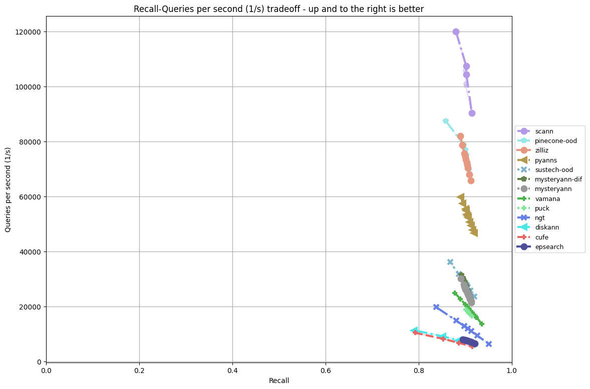

# Eval On AMD 3GHz/16-Core + 125GB RAM + NVMe SSD (Bare Metal)

## Table Of Contents

- [Introduction](#introduction)  
- [Results](#results) 
- [Hardware Inventory](#hardware_inventory)
- [How To Reproduce](#how_to_reproduce)
- [Disclaimers And Credits](#disclaimers_and_credits)  

## Introduction

The NeurIPS2023 Practical Vector Search Challenge evaluated participating algorithms on Azure and EC2 CPU-based hardware instances.

In pursuit of expanding the evaluation criteria, we are evaluating on other generally available hardware configurations.

Shown here are results run on the following hardware:
* AMD EPYC 9124 16-Core 3GHz processor
* 125GB RAM 
* 440GB NVMe SSD
* Bare-metal "m2-medium" instance provided by [Latitude](https://www.latitude.sh/) 

Note:
* We've included a [detailed hardware inventory.](#hardware_inventory)
* The [NeurIPS2023](README.md) Docker-based eval limits the use of available underlying resources.

## Results

### Track: Filter


### Track: Sparse


### Track: OOD



### Track: Streaming


### Data Export

The full data export CSV file can be found [here.](latitude/data_export_m2-medium.csv)

## Hardware_Inventory

* Via [*lshw*](latitude/m2-medium-lshw.txt)
* Via [*hwinfo*](latitude/m2-medium-hwinfo.txt)
* Via [*procinfo*](latitude/m2-medium-procinfo.txt)

## How_To_Reproduce

This section shows the steps you can use to reproduce the results shown above, from scratch.

A few algorithms did not complete and those errors are shown.

### System Preparation

* Signup for/sign into your Latitude account 
* Provision an "m2-medium" instance with at least 100GB NVMe SSD with Linux 20.04.06 LTS
* ssh remotely into the instance
* update Linux via command ```sudo apt-get update```
* install Anaconda for Linux
* run the following commands:
```
git clone git@github.com:harsha-simhadri/big-ann-benchmarks.git
cd big-ann-benchmarks
conda create -n bigann-latitude-m2-medium python=3.10
conda activate bigann-latitude-m2-medium
python -m pip install -r requirements_py3.10.txt 
```

### Sparse Track

Prepare the track dataset by running the following command in the top-level directory of the repository:
```
python create_dataset.py --dataset sparse-full
```

#### Sparse Algorithm: cufe

```
python install.py --neurips23track sparse --algorithm cufe
python -m pip install requests==2.31.0 # urllib3.exceptions.URLSchemeUnknown: Not supported URL scheme http+docker
```

#### Sparse Algorithm: linscan

```
python install.py --neurips23track sparse --algorithm linscan
python run.py --dataset sparse-full --algorithm linscan --neurips23track sparse
``` 

#### Sparse Algorithm: nle

```
python install.py --neurips23track sparse --algorithm nle
python run.py --dataset sparse-full --algorithm nle --neurips23track sparse
```

#### Sparse Algorithm: pyanns

```
python install.py --neurips23track sparse --algorithm pyanns
python run.py --dataset sparse-full --algorithm pyanns --neurips23track sparse
```

#### Sparse Algorithm: shnsw

```
python install.py --neurips23track sparse --algorithm shnsw
python run.py --dataset sparse-full --algorithm shnsw --neurips23track sparse
```

#### Sparse Algorithm: spmat

```
python install.py --neurips23track sparse --algorithm spmat
python run.py --dataset sparse-full --algorithm spmat --neurips23track sparse # ERROR: sparse-full is not in spmat/config.yaml
```

#### Sparse Algorithm: sustech-whu

```
python install.py --neurips23track sparse --algorithm sustech-whu 
# ERROR: git could not clone 'https://github.com/lizzy-0323/SUSTech-WHU-Sparse.git'
```

### Sparse Algorithm: pinecone_smips

```
python install.py --neurips23track sparse --algorithm pinecone_smips
python run.py --dataset sparse-full --algorithm pinecone_smips  --neurips23track sparse
```

#### Sparse Algorithm: zilliz

```
python install.py --neurips23track sparse --algorithm zilliz
python run.py --dataset sparse-full --algorithm zilliz --neurips23track sparse
```

### Filter Track

Prepare the track dataset by running the following command in the top-level directory of the repository:
```
python create_dataset.py --dataset yfcc-10M
```

#### Filter Algorithm: cufe

```
python install.py --neurips23track filter --algorithm cufe
python3 run.py --dataset yfcc-10M --algorithm cufe --neurips23track filter
```

#### Filter Algorithm: dhq

```
python install.py --neurips23track filter --algorithm dhq 
# ERROR: failed to solve: process "/bin/sh -c python3 -c 'import faiss; print(faiss.IDSelectorFilterWise); print(faiss.__version__)'" did not complete successfully: exit code: 1
```

#### Filter Algorithm: faiss

```
python install.py --neurips23track filter --algorithm faiss
python3 run.py --dataset yfcc-10M --algorithm faiss --neurips23track filter
```

#### Filter Algorithm: faissplus

```
python install.py --neurips23track filter --algorithm faissplus
python3 run.py --dataset yfcc-10M --algorithm faissplus --neurips23track filter
```

#### Filter Algorithm: fdufilterdiskann

```
python install.py --neurips23track filter --algorithm fdufilterdiskann
# ERROR: failed to solve: process "/bin/sh -c git clone --recursive --branch main https://github.com/PUITAR/FduFilterDiskANN.git" did not complete successfully: exit code: 128
```

#### Filter Algorithm: hwtl_sdu_anns_filter

```
python install.py --neurips23track filter --algorithm hwtl_sdu_anns_filter
# ERROR: failed to solve: process "/bin/sh -c python3 -c 'import faiss; print(faiss.IndexFlatL2); print(faiss.__version__)'" did not complete successfully: exit code: 1
```

#### Filter Algorithm: parlayivf

```
python install.py --neurips23track filter --algorithm parlayivf
python3 run.py --dataset yfcc-10M --algorithm parlayivf --neurips23track filter
```

#### Filter Algorithm: puck

```
python install.py --neurips23track filter --algorithm puck
python3 run.py --dataset yfcc-10M --algorithm puck --neurips23track filter
```

#### Filter Algorithm: pyanns

```
python install.py --neurips23track filter --algorithm pyanns
python3 run.py --dataset yfcc-10M --algorithm pyanns --neurips23track filter
```

#### Filter Algorithm: wm_filter

```
python install.py --neurips23track filter --algorithm wm_filter
python3 run.py --dataset yfcc-10M --algorithm wm_filter  --neurips23track filter
```

#### Filter Algorithm: pinecone

```
python install.py --neurips23track filter --algorithm pinecone
python run.py --neurips23track filter --algorithm pinecone --dataset yfcc-10M
```

#### Filter Algorithm: zilliz

```
python install.py --neurips23track filter --algorithm zilliz
python3 run.py --dataset yfcc-10M --algorithm zilliz  --neurips23track filter
```

### OOD Track

Prepare the track dataset by running the following command in the top-level directory of the repository:
```
python create_dataset.py --dataset text2image-10M 
```

#### OOD Algorithm: cufe

```
python install.py --neurips23track ood --algorithm cufe
python3 run.py --dataset text2image-10M --algorithm cufe --neurips23track ood
```

#### OOD Algorithm: diskann

```
python install.py --neurips23track ood --algorithm diskann
python3 run.py --dataset text2image-10M --algorithm diskann --neurips23track ood
```

#### OOD Algorithm: epsearch

```
python install.py --neurips23track ood --algorithm epsearch
python3 run.py --dataset text2image-10M --algorithm epsearch --neurips23track ood
```

#### OOD Algorithm: mysteryann

```
python install.py --neurips23track ood --algorithm mysteryann
python3 run.py --dataset text2image-10M --algorithm mysteryann --neurips23track ood
```

#### OOD Algorithm: mysteryann-dif

```
python install.py --neurips23track ood --algorithm mysteryann-dif
python3 run.py --dataset text2image-10M --algorithm mysteryann-dif --neurips23track ood
```

#### OOD Algorithm: ngt

```
python install.py --neurips23track ood --algorithm ngt
python3 run.py --dataset text2image-10M --algorithm ngt --neurips23track ood
```

#### OOD Algorithm: puck

```
python install.py --neurips23track ood --algorithm puck
python3 run.py --dataset text2image-10M --algorithm puck --neurips23track ood
```

#### OOD Algorithm: puck-fizz

```
python install.py --neurips23track ood --algorithm puck-fizz
ERROR: failed to solve: process "/bin/sh -c git clone -b ood-try https://github.com/baidu/puck.git" did not complete successfully: exit code: 128
```

#### OOD Algorithm: pyanns

```
python install.py --neurips23track ood --algorithm pyanns
python3 run.py --dataset text2image-10M --algorithm pyanns --neurips23track ood
```

#### OOD Algorithm: sustech-ood

```
python install.py --neurips23track ood --algorithm sustech-ood
python3 run.py --dataset text2image-10M --algorithm sustech-ood --neurips23track ood
```

#### OOD Algorithm: vamana

```
python install.py --neurips23track ood --algorithm vamana
python3 run.py --dataset text2image-10M --algorithm vamana --neurips23track ood
```

#### OOD Algorithm: pinecone-ood

```
python install.py --neurips23track ood --algorithm pinecone-ood
python run.py --neurips23track ood --algorithm pinecone-ood --dataset text2image-10M
```

#### OOD Algorithm: zilliz

```
python install.py --neurips23track ood --algorithm zilliz
python3 run.py --dataset text2image-10M --algorithm zilliz  --neurips23track ood
```

### Streaming Track

Prepare the track dataset by running the following command in the top-level directory of the repository:
```
python create_dataset.py --dataset msturing-30M-clustered
python -m benchmark.streaming.download_gt --runbook_file neurips23/streaming/final_runbook.yaml  --dataset msturing-30M-clustered
```

#### Streaming Algorithm: cufe

```
python install.py --neurips23track streaming --algorithm cufe
python3 run.py --dataset msturing-30M-clustered --algorithm cufe --neurips23track streaming --runbook_path neurips23/streaming/final_runbook.yaml
```

#### Streaming Algorithm: diskann

```
python install.py --neurips23track streaming --algorithm diskann
python3 run.py --dataset msturing-30M-clustered --algorithm diskann --neurips23track streaming --runbook_path neurips23/streaming/final_runbook.yaml
```

#### Streaming Algorithm: hwtl_sdu_anns_stream

```
python install.py --neurips23track streaming --algorithm hwtl_sdu_anns_stream 
python3 run.py --dataset msturing-30M-clustered --algorithm hwtl_sdu_anns_stream  --neurips23track streaming --runbook_path neurips23/streaming/final_runbook.yaml
```

#### Streaming Algorithm: puck

```
python install.py --neurips23track streaming --algorithm puck
python3 run.py --dataset msturing-30M-clustered --algorithm puck  --neurips23track streaming --runbook_path neurips23/streaming/final_runbook.yaml
```

#### Streaming Algorithm: pyanns

```
python install.py --neurips23track streaming --algorithm pyanns
python3 run.py --dataset msturing-30M-clustered --algorithm pyanns --neurips23track streaming --runbook_path neurips23/streaming/final_runbook.yaml # error, see below
2024-08-27 19:54:57,239 - annb.cfb02d822e66 - ERROR - Container.wait for container cfb02d822e66 failed with exception
2024-08-27 19:54:57,239 - annb.cfb02d822e66 - ERROR - Invoked with ['--dataset', 'msturing-30M-clustered', '--algorithm', 'pyanns', '--module', 'neurips23.streaming.pyanns.pyanns', '--constructor', 'Pyanns', '
--runs', '5', '--count', '10', '--neurips23track', 'streaming', '--runbook_path', 'neurips23/streaming/final_runbook.yaml', '["euclidean", {"R": 32, "L": 100, "insert_threads": 8, "consolidate_threads": 8}]', 
'[{"Ls": 300, "T": 8}]', '[{"Ls": 400, "T": 8}]', '[{"Ls": 500, "T": 8}]', '[{"Ls": 600, "T": 8}]']
Traceback (most recent call last):
  File "/home/gwilliams/anaconda3/envs/bigann-latitude-m2-medium/lib/python3.10/site-packages/urllib3/response.py", line 748, in _error_catcher
    yield
  File "/home/gwilliams/anaconda3/envs/bigann-latitude-m2-medium/lib/python3.10/site-packages/urllib3/response.py", line 1206, in read_chunked
    self._update_chunk_length()
  File "/home/gwilliams/anaconda3/envs/bigann-latitude-m2-medium/lib/python3.10/site-packages/urllib3/response.py", line 1125, in _update_chunk_length
    line = self._fp.fp.readline()  # type: ignore[union-attr]
  File "/home/gwilliams/anaconda3/envs/bigann-latitude-m2-medium/lib/python3.10/socket.py", line 705, in readinto
    return self._sock.recv_into(b)
TimeoutError: timed out
```

#### Streaming Algorithm: scann

```
python install.py --neurips23track streaming --algorithm scann
python3 run.py --dataset msturing-30M-clustered --algorithm scann --neurips23track streaming --runbook_path neurips23/streaming/final_runbook.yaml 
```
#### Streaming Algorithm: pinecone

```
python install.py --neurips23track streaming --algorithm pinecone
python3 run.py --dataset msturing-30M-clustered --algorithm pinecone --neurips23track streaming --runbook_path neurips23/streaming/final_runbook.yaml # error, see below
2024-08-27 23:26:17,631 - annb.001a9034d319 - ERROR - Container.wait for container 001a9034d319 failed with exception
2024-08-27 23:26:17,631 - annb.001a9034d319 - ERROR - Invoked with ['--dataset', 'msturing-30M-clustered', '--algorithm', 'pinecone', '--module', 'neurips23.streaming.pinecone.pinecone', '
--constructor', 'pinecone', '--runs', '5', '--count', '10', '--neurips23track', 'streaming', '--runbook_path', 'neurips23/streaming/final_runbook.yaml', '["euclidean", {"R": 32, "L": 100, 
"insert_threads": 8, "consolidate_threads": 8}]', '[{"Ls": 300, "k_1": 30, "T": 8}]', '[{"Ls": 400, "k_1": 30, "T": 8}]', '[{"Ls": 500, "k_1": 30, "T": 8}]', '[{"Ls": 520, "k_1": 30, "T": 
8}]', '[{"Ls": 540, "k_1": 30, "T": 8}]', '[{"Ls": 560, "k_1": 30, "T": 8}]']
Traceback (most recent call last):
  File "/home/gwilliams/anaconda3/envs/bigann-latitude-m2-medium/lib/python3.10/site-packages/urllib3/response.py", line 748, in _error_catcher
    yield
  File "/home/gwilliams/anaconda3/envs/bigann-latitude-m2-medium/lib/python3.10/site-packages/urllib3/response.py", line 1206, in read_chunked
    self._update_chunk_length()
  File "/home/gwilliams/anaconda3/envs/bigann-latitude-m2-medium/lib/python3.10/site-packages/urllib3/response.py", line 1125, in _update_chunk_length
    line = self._fp.fp.readline()  # type: ignore[union-attr]
  File "/home/gwilliams/anaconda3/envs/bigann-latitude-m2-medium/lib/python3.10/socket.py", line 705, in readinto
    return self._sock.recv_into(b)
TimeoutError: timed out
```
### Analysis

To extract the data as CSV:
```
sudo chmod ugo+r -R ./results/ # recursively add read permissions to data files
python data_export.py --recompute --output neurips23/latitude/data_export_m2-medium.csv
```

To plot individual tracks:
```
python plot.py --neurips23track sparse --output neurips23/latitude/sparse.png --raw --recompute --dataset sparse-full
python plot.py --neurips23track filter --output neurips23/latitude/filter.png --raw --recompute --dataset yfcc-10M
python plot.py --neurips23track ood --output neurips23/latitude/ood.png --raw --recompute --dataset text2image-10M
TODO: streaming
```

## Disclaimers_And_Credits

* The hardware systems were graciously donated by [Latitude](https://www.latitude.sh/)
* None of the Neurips2021/23 organizers is an employee or affiliated with Latitude.
* [George Williams](https://github.com/sourcesync), an organizer for both the NeurIPS2021 and NeurIPS2023 Competitions ran the evaluations described above.
* Our main contact from Latitude is [Victor Chiea](victor.chiea@latitude.sh), whom we were introduced by [Harald Carlens](harald@mlcontests.com) from [MLContests](https://mlcontests.com/).
* Latitude logo for sponsorship attribution below (note: it has a transparent background):

