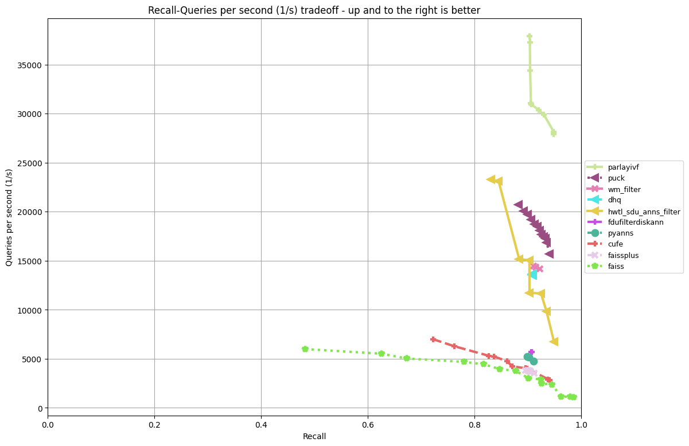
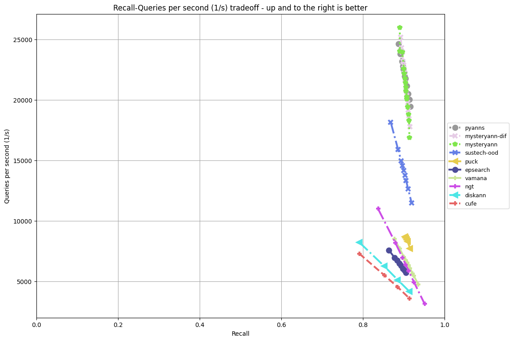
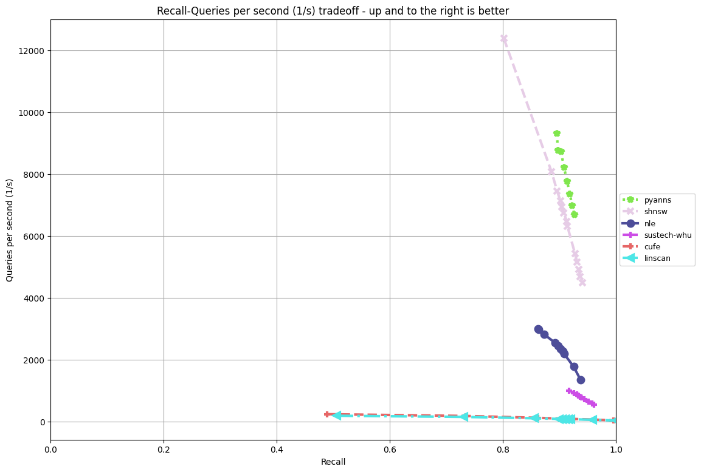

### Leaderboard

This leaderboard is based on the standard recall@10 vs throughput benchmark that has become a standard benchmark when evaluating and comparing approximate nearest neighbor algorithms. 
The recall of the baselines at this QPS threshold is listed [above](#measuring_your_algorithm). 

For tasks "Filter", "Out-of-Distribution" and "Sparse" tracks, algorithms were ranked on the QPS they achieve on the track dataset, as long as the recall@10 is at least 90%. 
These results files for [Azure D8lds_v5](Azure_D8lds_v5_table.md) and [AWS EC2 c6i.2xlarge](ec2_c6i.2xlarge_table.md) list the maximum QPS measured for each algorihtm with at least 90% recall@10.

For the Streaming track, algorithms were ranked on recall@10, as long as each algorithm completes the runbook within the alloted 1 hour. The leading entry had a recall of 0.9849.
The [result file](streaming/res_final_runbook_AzureD8lds_v5.csv) lists measurements for all streaming algorithms on Azure D8lds_v5.

QPS vs recall@10 plots for tracks based on public queries on Azure D8lds_v5:
**Filter track**

**OOD track**

**Sparse track**

More plots to follow.
