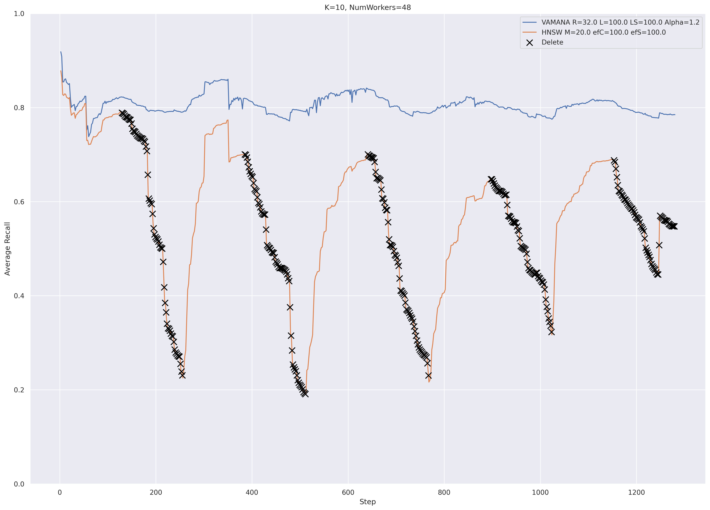
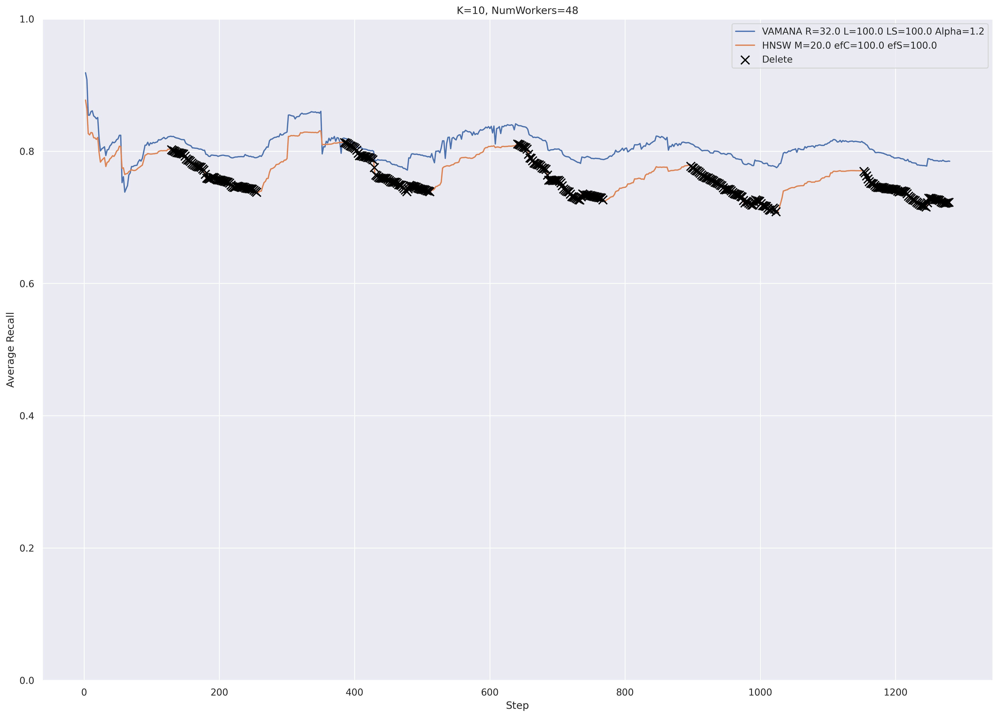
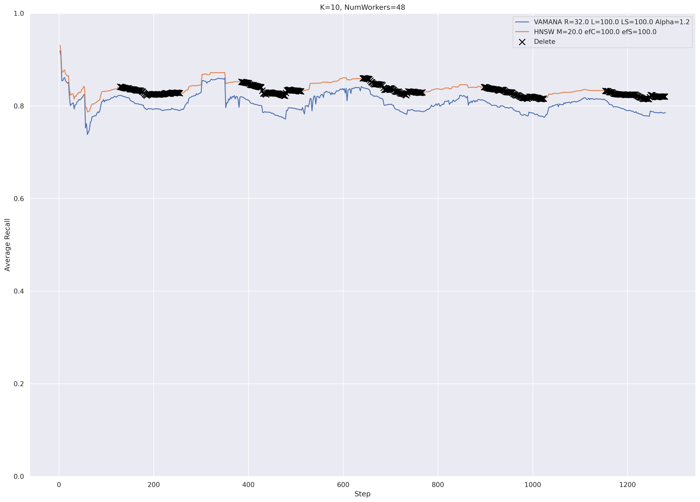

# Final Runbook Results of Vamana and HNSW Implementations

We look at the recall stability of DiskANN's Vamana and various HNSW implementations
under streaming workload provided by the final runbook.
It is important to note that Vamana and HNSW are set up with different parameters,
so rather than comparing the absolute recall values, we compare the stability of
recall over the duration of the workload.

## Vamana and HNSW with search-based edge repair algorithm.

For graph ANN indexes supporting in-place deletes, they all need to perform 
edge repair to maintain the graph structure. Edge repair is done for each
in-coming neighbor of a deleted point, as the deleted point is removed from
the neighbor's adjacency list.

Search-based edge repair algorithm is implemented by [`hnswlib`](https://github.com/nmslib/hnswlib)
in a function called [`repairConnectionsForUpdate`](https://github.com/nmslib/hnswlib/blob/359b2ba87358224963986f709e593d799064ace6/hnswlib/hnswalg.h#L987). The idea is to perform a "re-insert" of the node to be repaired
and update its adjacency lists of all levels.

## Vamana and HNSW with Vamana's edge repair algorithm.

Vamana's edge repair algorithm is different from the previously described search-based edge repair
algorithm. The idea is to connect each in-coming neighbor of a deleted node to the 
out-going neighbors of the deleted node, while applying a pruning step to maintain
the maximum degree constraint. In this case, we use HNSW's original pruning
algorithm. It is implemented by `hnswlib` in a function called 
[`getNeighborsByHeuristic2`](https://github.com/nmslib/hnswlib/blob/359b2ba87358224963986f709e593d799064ace6/hnswlib/hnswalg.h#L382C16-L382C16)

## Vamana and HNSW with Vamana's edge repair and robust pruning algorithm.

Lastly, we replaces HNSW's pruning algorithm with Vamana's. Now the HNSW
algorithm is exactly the same as Vamana's, except that it has multiple layers.
We can call this "Multi-layer Vamana".

