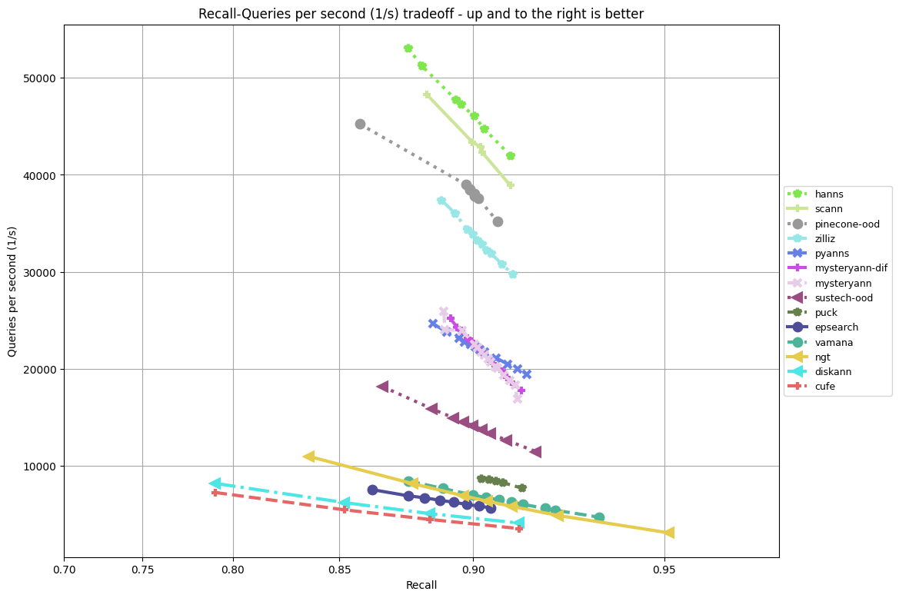
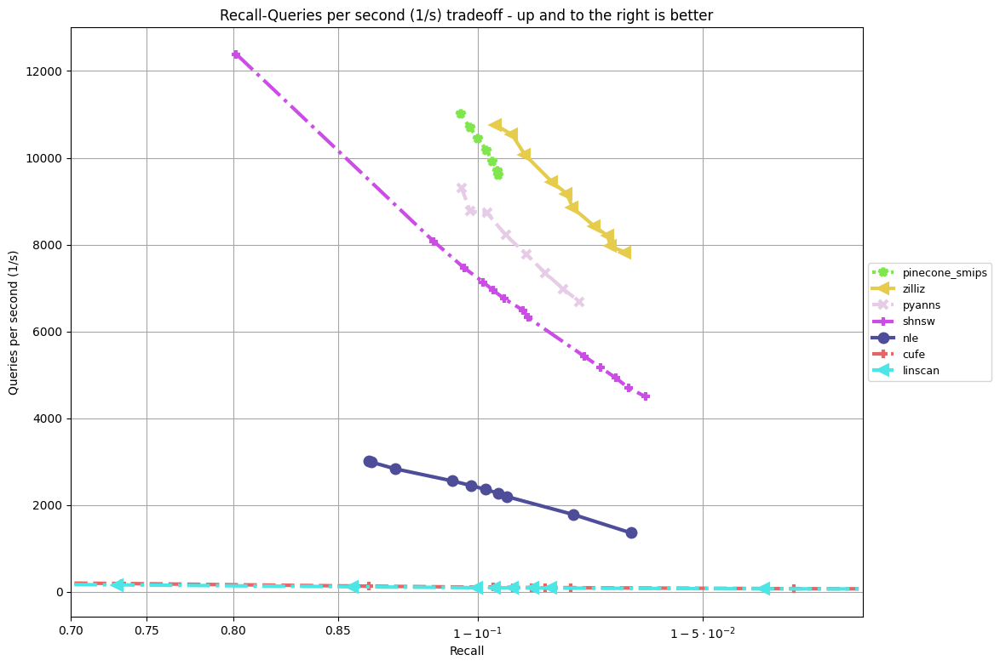

## Ongoing Leaderboard

This leaderboard tracks the performance of submitted algorithms, starting at NeurIPS'23, including new algorithms. It is evaluated periodically, see details [below](#ongoing-leaderboard-rules).  

This leaderboard tracks recall@10 vs throughput benchmark that has become a standard benchmark when evaluating and comparing approximate nearest neighbor algorithms.  

For tasks "Filter", "Out-of-Distribution" and "Sparse" tracks, algorithms were ranked on the QPS they achieve on the track dataset, as long as the recall@10 is at least 90%. 
These results file for [Azure D8lds_v5](Azure_D8lds_v5_table.md) list the maximum QPS measured for each algorithm with at least 90% recall@10.

For the Streaming track, algorithms were ranked on recall@10, as long as each algorithm completes the runbook within the alloted 1 hour. The leading entry had a recall of 0.99786, see details [below](#streaming-track).

To see the original leaderboard of the NeurIPS'23 submissions (Dec. 2023), see [here](../leaderboard.md).

QPS vs recall@10 plots for tracks based on public queries on Azure D8lds_v5:
### Filter track

Note: "pinecone", "zilliz" and "hwtl_sdu_anns_filter" are not open source

### OOD track

Note: "pinecone-ood" and "zilliz" are not open source

### Sparse track

Note: "pinecone_smips" and "zilliz" are not open source

### Streaming track
The [result file](streaming/res_final_runbook_AzureD8lds_v5.csv) lists measurements for all streaming algorithms on Azure D8lds_v5. 

While the highest achieved recall@10 is 0.99786 (by pinecone), the similar submission by zilliz has almost the same recall at 0.99768. Since in the current setup of the track it seems that there is little innovation left, this streaming track in its current form will no longer be tracked in future leaderboards.

## Ongoing Leaderboard Rules

The leaderboard is evaluated periodically, collecting new algorithm submissions. The current update is from Feb. 1st, 2024. The next update is scheduled to March 1st.

The rules of the ongoing leaderboard are similar to the original competition, with the following exceptions:
- Open source is encouraged but not enforced. Closed-source entries will be marked as such. In any case, a short description of the algorithm is required. 
- We will only evaluate the public query sets in the new leaderboard (on the same VM type: Azure Standard D8lds v5 with 8 vcpus, 16 GiB memory) 
- To participate, simply send a PR with the new algorithm (no need for a CMT entry).

