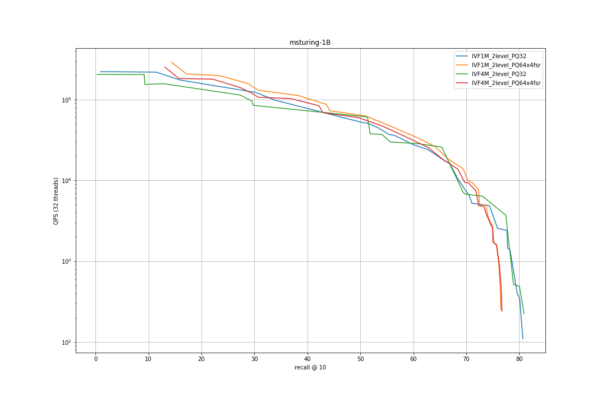
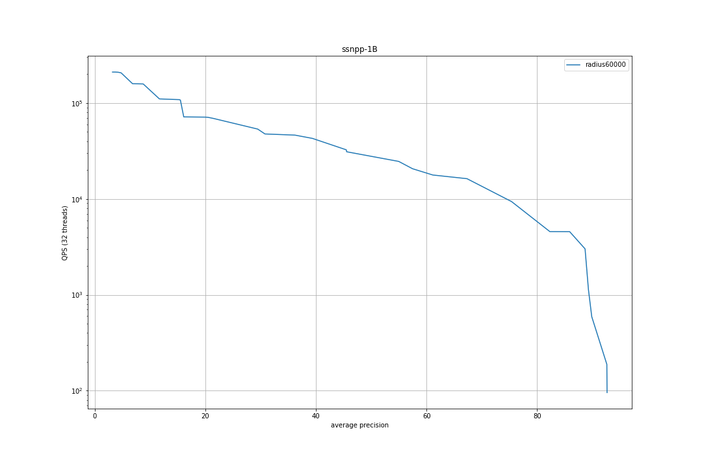
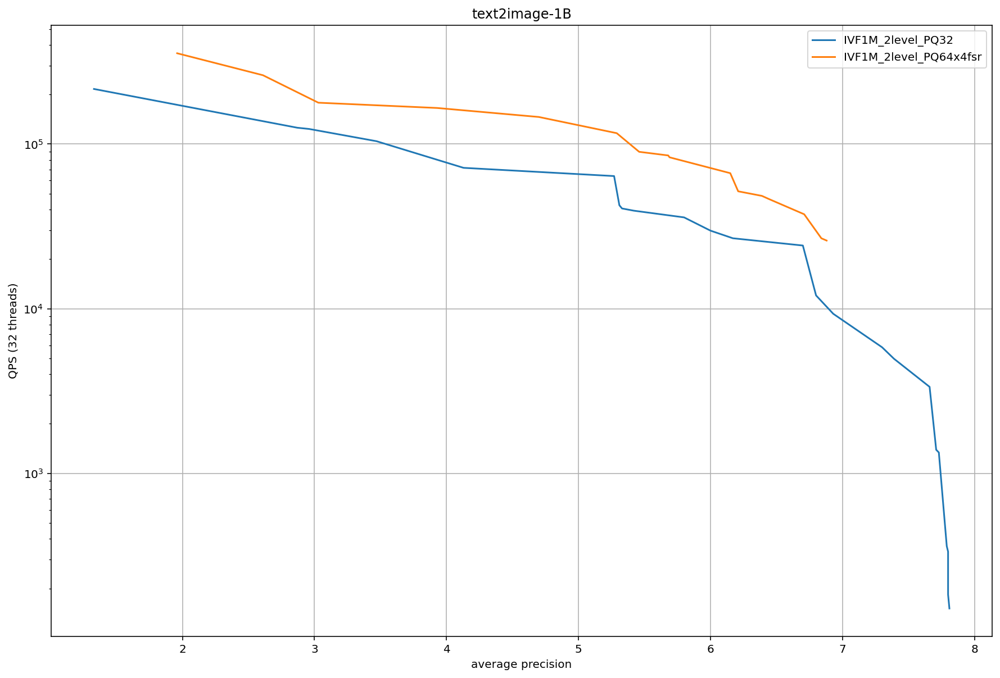

# Running the Faiss baselines 

## Installing software 

In addition to this repository, running the baseline code requires a conda install with Faiss

```bash
wget  https://repo.anaconda.com/archive/Anaconda3-2020.11-Linux-x86_64.sh

bash  Anaconda3-2020.11-Linux-x86_64.sh

# follow instructions and run profile.sh to get a working conda

conda create -n faiss_1.7.1 python=3.8
conda activate faiss_1.7.1
conda install -c pytorch faiss-cpu
```

All instructions below are supposed to be run from the root of the repository. 
To make the package accessible, set `export PYTHONPATH=.`

## Downloading the data 

To download the data (database files, query files and ground truth, do 
```
mkdir data/    # this is where all the data goes, a symlink is fine
python  track1_baseline_faiss/baseline_faiss.py --dataset deep-1B --prepare
```
The available datasets are bigann-1B deep-1B ssnpp-1B text2image-1B msturing-1B msspacev-1B. 
To download the largest files, `--prepare` will use axel or azcopy. Make sure that they are in the path.

Replace the -1B suffix with -100M or -10M to get a subset of each dataset (only the relevant fraction of the database will be downloaded). 
This is useful for small-scale experiments.

## Building the index 

There are several types of indexes in Faiss. 
Here we focus on IVF variants with PQ compression as recommended [here](https://github.com/facebookresearch/faiss/wiki/Guidelines-to-choose-an-index#if-100m---1b-ivf1048576_hnsw32) and evaluated [here](https://github.com/facebookresearch/faiss/wiki/Indexing-1G-vectors#1b-datasets). 

The problem is that they require very large codebooks to define the IVF clusters. 
This is fine (kind of) when a GPU is available to run the clustering, but not on CPU only. 
Therefore, we perform a two-level clustering with n' = sqrt(ncentroids) first level cluster and n' clusterings of size n' at a refined level. 
Then all n' * n' sub-clusters are indexed together in an IVF_HNSW.

This writes like: 

```bash
python -u track1_baseline_faiss/baseline_faiss.py --dataset deep-1B \
    --indexkey OPQ64_128,IVF1048576_HNSW32,PQ64x4fsr \
    --maxtrain 100000000 \
    --two_level_clustering \
    --build \
    --add_splits 30 \
    --indexfile data/track1_baseline_faiss/deep-1B.IVF1M_2level_PQ64x4fsr.faissindex \
    --quantizer_efConstruction 200 \
    --quantizer_add_efSearch 80 
```

This works for deep-1B bigann-1B msturing-1B msspacev-1B. 

For ssnpp-1B, the type of index has to be adjusted a bit because the Faiss PQ64x4fsr does not support range search (see [the documentation of Faiss index types](https://github.com/facebookresearch/faiss/wiki/The-index-factory#encodings) for an explanation of the difference). 

Therefore, we use a slightly slower index type: PQ32. This gives: 
```bash
python -u track1_baseline_faiss/baseline_faiss.py --dataset ssnpp-1B \
    --indexkey OPQ64_128,IVF1048576_HNSW32,PQ32 \
    --maxtrain 100000000 \
    --two_level_clustering \
    --build \
    --add_splits 30 \
    --indexfile data/track1_baseline_faiss/ssnpp-1B.IVF1M_2level_PQ23.faissindex \
    --quantizer_efConstruction 200 \
    --quantizer_add_efSearch 80 
```

The results on text2image-1B with the same index types are a lot worse.
This is probably due to the very lossy PQ compression. 

## Running the evaluation

### Getting the pre-built indexes 

Pre-built indexes are available. 
To download them 

```bash
wget https://dl.fbaipublicfiles.com/billion-scale-ann-benchmarks/track1_baseline_faiss/deep-1B.IVF1M_2level_PQ64x4fsr.faissindex -P data/
wget https://dl.fbaipublicfiles.com/billion-scale-ann-benchmarks/track1_baseline_faiss/bigann-1B.IVF1M_2level_PQ64x4fsr.faissindex -P data/
wget https://dl.fbaipublicfiles.com/billion-scale-ann-benchmarks/track1_baseline_faiss/msturing-1B.IVF1M_2level_PQ64x4fsr.faissindex -P data/
wget https://dl.fbaipublicfiles.com/billion-scale-ann-benchmarks/track1_baseline_faiss/msspacev-1B.IVF1M_2level_PQ64x4fsr.faissindex -P data/

wget https://dl.fbaipublicfiles.com/billion-scale-ann-benchmarks/track1_baseline_faiss/ssnpp-1B.IVF1M_2level_PQ32.faissindex -P data/
wget https://dl.fbaipublicfiles.com/billion-scale-ann-benchmarks/track1_baseline_faiss/text2image-1B.IVF1M_2level_PQ32.faissindex -P data/

```


### Running the evaluation


The evaluation proceeds by loading the index and looping over a set of search-time parameters that obtain different speed-accuracy tradeoffs. 

This writes as: 
```bash

params="
nprobe=1,quantizer_efSearch=4
nprobe=2,quantizer_efSearch=4
...
nprobe=512,quantizer_efSearch=256
nprobe=512,quantizer_efSearch=512
nprobe=1024,quantizer_efSearch=512
"

python  track1_baseline_faiss/baseline_faiss.py \
   --dataset deep-1B --indexfile data/deep-1B.IVF1M_2level_PQ64x4fsr.faissindex \
   --search --searchparams $params

```

The sets of parameters per dataset are listed in [this GIST](https://gist.github.com/mdouze/bb71032f0b3bf3cc9bdaa6ff1287c144). 
They are ordered from fastest / least accurate to slowest / most accurate.

### Results 

The results should look like: 

```
parameters                               inter@ 10 time(ms/q)   nb distances #runs
nprobe=1,quantizer_efSearch=4            0.1738      0.00327       12210374    92
nprobe=2,quantizer_efSearch=4            0.2394      0.00424       24328050    71
nprobe=2,quantizer_efSearch=8            0.2879      0.00545       24278048    56
...
nprobe=512,quantizer_efSearch=256        0.6877      0.75883     5896044691    1
nprobe=512,quantizer_efSearch=512        0.6886      0.77421     5890639041    1
nprobe=1024,quantizer_efSearch=512       0.6886      1.46841    11607413418    1
```

This means that by setting the parameters `nprobe=2,quantizer_efSearch=4`, we obtain 0.2394 recall @ 10 (aka inter @10) for that dataset, the search will take  0.00327 ms per query (305810 QPS). 
The total number of distances computed for all queries is 24328050 and this measurement was obtained in 71 runs (to reduce jitter in time measurements).


### Plots

The speed-accuracy tradeoff plots are here (with 32 threads on a given 2.2Ghz machine): 










### Determining the optimal search-time parameters

The Pareto-optimal parameter combinations can be obtained by a random exploration of the parameter space, as described [here](https://github.com/facebookresearch/faiss/wiki/Index-IO,-cloning-and-hyper-parameter-tuning#auto-tuning-the-runtime-parameters). 
To perform this operation, do:
```bash
python  track1_baseline_faiss/baseline_faiss.py \
   --dataset deep-1B --indexfile data/deep-1B.IVF1M_2level_PQ64x4fsr.faissindex \
   --search 
```
