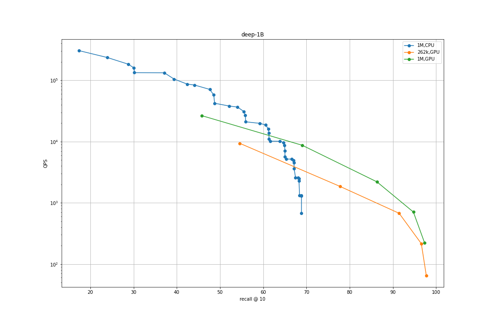

# Running the Faiss GPU baseline

The script here is based on the T1 baseline, so please take a look at [the Track 1 baseline](../track1_baseline_faiss/README.md) first. 

## Installing software 

See [this doc](../track1_baseline_faiss/README.md#installing-software) but instead of installing faiss-cpu, use: 

```
conda install -c pytorch faiss-gpu cudatoolkit=10.2
```

## How to use the GPU

This script focuses on exploiting the GPU for coarse quantization. 
Therefore, it is suitable for large codebooks. 

The GPU can be used in the following phases: 

- training: `--train_with_gpu` will move the training of the coarse quantizer to GPU

- vector adding to the index: `--quantizer_on_gpu_add --` will do the adding on GPU

- search: `--parallel_mode 3  --quantizer_on_gpu_search` will do coarse quantization on GPU at search time. 

## Building the index and searching 

The hardware environment is: 1 GPU on a machine with 768G RAM (practically unlimited). 
Therefore, the approach is to do the coarse quantization on GPU and store the IVF index in RAM with mild compression (PQ8). 
This means that to keep the GPU busy the number of centroids should be as large as possible. 
We use 1M in the example below.
The GPU uses brute force computations to find the nearest centroids. 

### 100M-scale 

The following command runs the index constuction and evaluates the search performance: 

```bash
python track3_baseline_faiss/gpu_baseline_faiss.py --dataset deep-100M \
         --indexkey IVF65536,SQ8 \
         --train_on_gpu \
         --build --quantizer_on_gpu_add --add_splits 30 \
         --search \
         --searchparams nprobe={1,4,16,64,256}   \
         --parallel_mode 3  --quantizer_on_gpu_search
```

Example logs [without GPU](https://gist.github.com/mdouze/9e000be47c499f79aaec0166365ef654) and [with GPU](https://gist.github.com/mdouze/cd14c802b924299aa2a92db6e05df857) at search time.


### 1B-scale 

```bash
python track3_baseline_faiss/gpu_baseline_faiss.py --dataset deep-1B \
         --indexkey IVF$((1<<18)),SQ8 \
         --train_on_gpu \
         --build --quantizer_on_gpu_add --add_splits 30 \
         --search \
         --searchparams nprobe={1,4,16,64,256}   \
         --parallel_mode 3  --quantizer_on_gpu_search
```


For the SSNPP dataset, please use `--parallel_mode 2` instead. 


### Results 

Similar to the track 1 results, we can plot the GPU search results in a plot of recall@10 vs. QPS. 



Caveat: here the GPU uses 20 CPU threads vs. 32 for the CPU, and the search is actually performed on 2 GPUs. 
